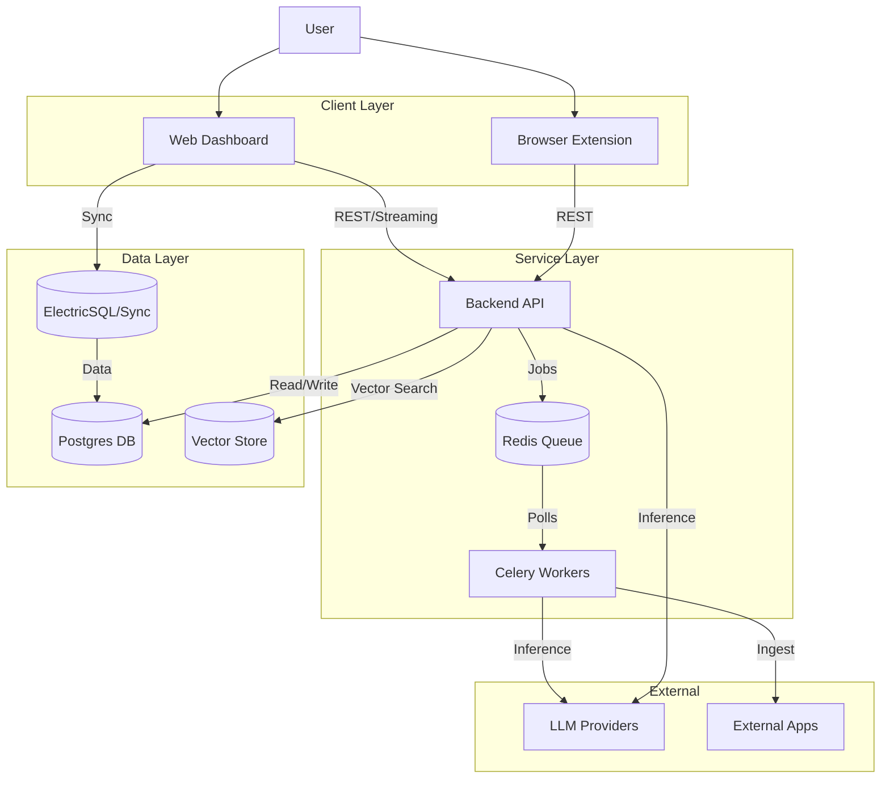

# Kiến Trúc Tích Hợp

Tài liệu này phác thảo cách ba thành phần của SurfSense (Backend, Web, Extension) giao tiếp và chia sẻ dữ liệu.

## Sơ Đồ Hệ Thống

## Các Điểm Tích Hợp (Integration Points)

### 1. Web tới Backend
- **Giao thức**: HTTP/REST + Server-Sent Events (SSE) cho Streaming
- **Xác thực**: OAuth / Bearer Token
- **Trao đổi chính**:
    - **Chat**: Web gửi prompts -> Backend stream tokens + tool updates.
    - **Config**: Web gửi cài đặt connector -> Backend xác thực & lưu trữ.
    - **Search**: Web yêu cầu tìm kiếm -> Backend chạy RAG pipeline -> Trả về kết quả.

### 2. Extension tới Backend
- **Giao thức**: HTTP/REST
- **Mục đích**: Data ingestion (Lịch sử, Ngữ cảnh)
- **Luồng (Flow)**: Extension thu thập hoạt động duyệt web -> Đóng gói dữ liệu (Batching) -> Đẩy (Push) tới các endpoint `/ingest` của Backend.

### 3. Đồng bộ Dữ liệu (ElectricSQL)
- **Thành phần**: Web <-> Database
- **Mục đích**: Đồng bộ trạng thái thời gian thực (Real-time state synchronization) cho các tính năng cộng tác (như trạng thái chat chia sẻ) hoặc giữ cho giao diện frontend (optimistic UI) đồng bộ mà không cần refetch thủ công.

### 4. Backend tới AI Connectors
- **Giao thức**: Các API khác nhau (Slack API, Notion API, v.v.)
- **Luồng (Flow)**: Celery Workers thực thi các tác vụ nền (background jobs) để crawl/tải dữ liệu từ ứng dụng được kết nối của người dùng -> Xử lý/Phân mảnh (Process/Chunk) -> Lưu vào Vector DB.
