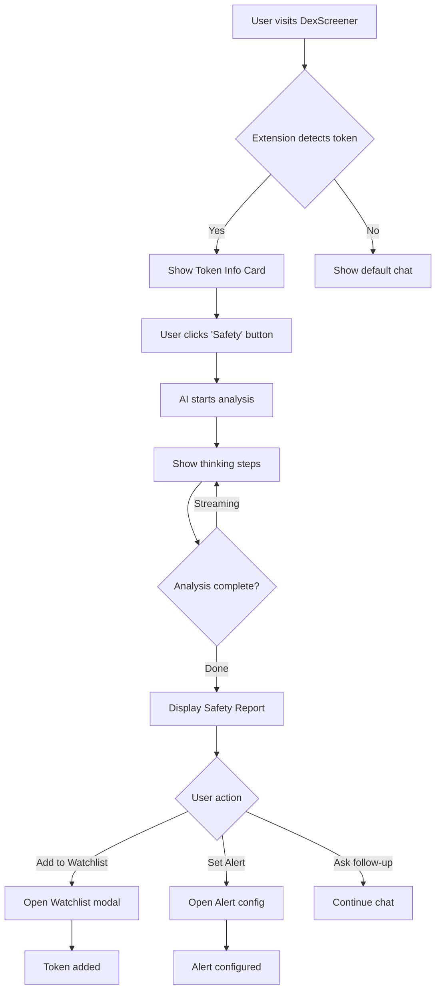
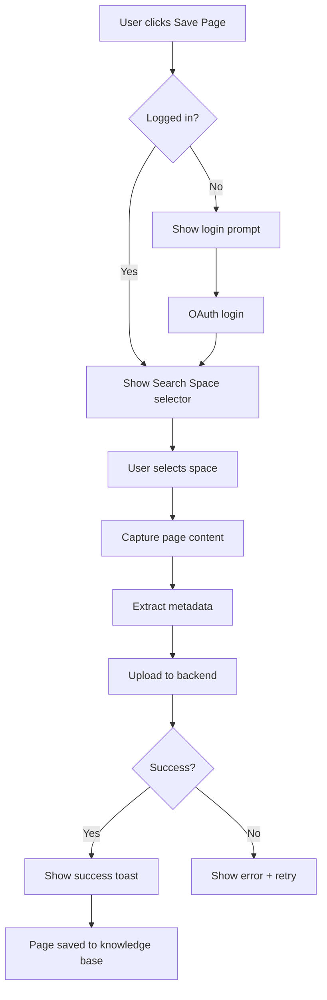

# SurfSense 2.0 - Complete UX Design Specification

**Version:** 2.0
**Date:** 2026-02-02
**Status:** ✅ COMPLETE
**Owner:** UX Designer

---

## Executive Summary

This document provides comprehensive UX specifications for SurfSense 2.0 Crypto Co-Pilot, covering:
1. **Browser Extension** - Chrome Side Panel with AI chat and token analysis
2. **Web Dashboard Improvements** - Enhanced chat interface and crypto features
3. **New Features** - Watchlist, Alerts, Portfolio Tracker, Rug Pull Detection

---

## Part 1: Browser Extension UX

### 1.1 Information Architecture

```
Side Panel (400px width)
├── Header (56px)
│   ├── Logo + Brand
│   ├── Search Space Selector
│   └── Settings Menu
├── Context Card (conditional, 140px)
│   ├── Token Info (DexScreener)
│   ├── Tweet Analysis (Twitter/X)
│   └── Article Summary (News sites)
├── Chat Area (flex-grow)
│   ├── Welcome State (empty)
│   ├── Messages List
│   └── Thinking Steps
├── Input Area (120px)
│   ├── Text Input
│   ├── Attachments
│   └── Quick Actions
└── Quick Capture (48px sticky)
```

### 1.2 Detailed Wireframes

#### 1.2.1 Main Chat Interface - Empty State

```
┌─────────────────────────────────────────┐
│ 🌊 SurfSense        [Crypto ▼] [⚙️] [👤]│
├─────────────────────────────────────────┤
│                                         │
│                                         │
│           🌊                            │
│                                         │
│     Good morning, Alex!                 │
│                                         │
│   Your AI co-pilot for crypto           │
│   research and analysis                 │
│                                         │
│   ┌─────────────────────────────────┐   │
│   │ Ask about any token, market     │   │
│   │ trends, or save insights...     │   │
│   │                          [📎][→]│   │
│   └─────────────────────────────────┘   │
│                                         │
│   💡 Try asking:                        │
│   ┌─────────────────────────────────┐   │
│   │ "Is $PEPE safe to invest?"      │   │
│   └─────────────────────────────────┘   │
│   ┌─────────────────────────────────┐   │
│   │ "Top gainers on Solana today"   │   │
│   └─────────────────────────────────┘   │
│   ┌─────────────────────────────────┐   │
│   │ "Analyze this wallet: 0x..."    │   │
│   └─────────────────────────────────┘   │
│                                         │
├─────────────────────────────────────────┤
│  📸 Save this page to knowledge base    │
└─────────────────────────────────────────┘
```

#### 1.2.2 Token Context Card (DexScreener Detection)

```
┌─────────────────────────────────────────┐
│ 🌊 SurfSense        [Crypto ▼] [⚙️] [👤]│
├─────────────────────────────────────────┤
│ ┌─────────────────────────────────────┐ │
│ │ 🪙 BULLA / SOL                      │ │
│ │ Solana • CA: 7xKX...3nPq            │ │
│ │                                     │ │
│ │ $0.00001234        ▲ +156.7%        │ │
│ │                    24h change       │ │
│ │                                     │ │
│ │ ┌─────────┐ ┌─────────┐ ┌─────────┐ │ │
│ │ │ Vol 24h │ │Liquidity│ │ MCap    │ │ │
│ │ │ $1.2M   │ │ $450K   │ │ $2.1M   │ │ │
│ │ └─────────┘ └─────────┘ └─────────┘ │ │
│ │                                     │ │
│ │ Quick Analysis:                     │ │
│ │ ┌────────┐┌────────┐┌────────┐┌────┐│ │
│ │ │🛡️Safety││👥Holder││📈Predic││⚠️Rug││ │
│ │ └────────┘└────────┘└────────┘└────┘│ │
│ └─────────────────────────────────────┘ │
├─────────────────────────────────────────┤
│                                         │
│  [User] Is this token safe to buy?      │
│                                         │
│  [AI] Analyzing BULLA token...          │
│  ┌─────────────────────────────────┐    │
│  │ 🔍 Checking contract...         │    │
│  │ 📊 Analyzing holder distribution│    │
│  │ 💧 Verifying liquidity lock...  │    │
│  └─────────────────────────────────┘    │
│                                         │
├─────────────────────────────────────────┤
│ ┌─────────────────────────────────────┐ │
│ │ Ask follow-up question...    [📎][→]│ │
│ └─────────────────────────────────────┘ │
├─────────────────────────────────────────┤
│  📸 Save this page to knowledge base    │
└─────────────────────────────────────────┘
```

#### 1.2.3 AI Response with Safety Analysis

```
┌─────────────────────────────────────────┐
│  [AI] 🛡️ Safety Analysis: BULLA/SOL    │
│                                         │
│  ┌─────────────────────────────────────┐│
│  │ Overall Risk Score: 🟡 MEDIUM       ││
│  │ ████████░░ 65/100                   ││
│  └─────────────────────────────────────┘│
│                                         │
│  ✅ Positive Signals:                   │
│  • Contract verified on Solscan         │
│  • No mint authority (can't create more)│
│  • LP locked for 6 months               │
│                                         │
│  ⚠️ Warning Signs:                      │
│  • Top 10 holders own 45% of supply     │
│  • Token is only 3 days old             │
│  • Low social media presence            │
│                                         │
│  🔴 Red Flags:                          │
│  • Similar contract to known rug pulls  │
│                                         │
│  📊 Holder Distribution:                │
│  ┌─────────────────────────────────────┐│
│  │ Top 10: ████████░░ 45%              ││
│  │ Top 50: ██████████████░░ 72%        ││
│  │ Others: ██████░░░░░░░░░░ 28%        ││
│  └─────────────────────────────────────┘│
│                                         │
│  💡 Recommendation:                     │
│  Proceed with caution. Consider small   │
│  position size due to concentration     │
│  risk and young token age.              │
│                                         │
│  Sources: Solscan, DexScreener, RugCheck│
└─────────────────────────────────────────┘
```

#### 1.2.4 Watchlist Panel

```
┌─────────────────────────────────────────┐
│ 🌊 SurfSense   [📋 Watchlist] [⚙️] [👤] │
├─────────────────────────────────────────┤
│ My Watchlist                    [+ Add] │
├─────────────────────────────────────────┤
│ ┌─────────────────────────────────────┐ │
│ │ 🪙 BULLA/SOL          ▲ +156.7%    │ │
│ │ $0.00001234           Vol: $1.2M   │ │
│ │ 🔔 Alert: Price > $0.00002         │ │
│ └─────────────────────────────────────┘ │
│ ┌─────────────────────────────────────┐ │
│ │ 🪙 PEPE/ETH           ▼ -12.3%     │ │
│ │ $0.00000891           Vol: $45M    │ │
│ │ 🔔 Alert: Volume spike detected    │ │
│ └─────────────────────────────────────┘ │
│ ┌─────────────────────────────────────┐ │
│ │ 🪙 WIF/SOL            ▲ +8.2%      │ │
│ │ $2.34                 Vol: $89M    │ │
│ │ ✓ No active alerts                 │ │
│ └─────────────────────────────────────┘ │
├─────────────────────────────────────────┤
│ Recent Alerts                           │
├─────────────────────────────────────────┤
│ 🔴 2m ago: BULLA whale sold 5% supply   │
│ 🟡 15m ago: PEPE unusual volume spike   │
│ 🟢 1h ago: WIF hit price target $2.30   │
├─────────────────────────────────────────┤
│ ┌─────────────────────────────────────┐ │
│ │ Ask about your watchlist...  [📎][→]│ │
│ └─────────────────────────────────────┘ │
└─────────────────────────────────────────┘
```

#### 1.2.5 Alert Configuration Modal

```
┌─────────────────────────────────────────┐
│ 🔔 Configure Alert for BULLA/SOL    [×]│
├─────────────────────────────────────────┤
│                                         │
│ Alert Type:                             │
│ ┌─────────────────────────────────────┐ │
│ │ ○ Price reaches                     │ │
│ │ ○ Price change % (24h)              │ │
│ │ ● Volume spike                      │ │
│ │ ○ Whale movement                    │ │
│ │ ○ Liquidity change                  │ │
│ │ ○ New holder concentration          │ │
│ └─────────────────────────────────────┘ │
│                                         │
│ Condition:                              │
│ ┌─────────────────────────────────────┐ │
│ │ Volume increases by [  200  ] %     │ │
│ │ within [ 1 hour ▼ ]                 │ │
│ └─────────────────────────────────────┘ │
│                                         │
│ Notification:                           │
│ ☑ Browser notification                  │
│ ☑ Email alert                           │
│ ☐ Telegram (connect in settings)        │
│                                         │
│ ┌─────────────────────────────────────┐ │
│ │         💾 Save Alert               │ │
│ └─────────────────────────────────────┘ │
│                                         │
└─────────────────────────────────────────┘
```

### 1.3 User Flows

#### 1.3.1 Token Safety Check Flow



#### 1.3.2 Quick Capture Flow



---

## Part 2: Web Dashboard UX Improvements

### 2.1 Current State Analysis

**Strengths:**
- Clean chat interface with streaming responses
- Good document mention system (@mentions)
- Thinking steps visualization
- Real-time collaboration indicators

**Areas for Improvement:**
- No crypto-specific features in dashboard
- Watchlist management only in extension
- Alert history not visible
- No portfolio integration

### 2.2 Proposed Dashboard Enhancements

#### 2.2.1 New Crypto Dashboard Tab

```
┌──────────────────────────────────────────────────────────────────────────┐
│ 🌊 SurfSense                                              [Alex ▼] [⚙️] │
├────────┬─────────────────────────────────────────────────────────────────┤
│        │ 📊 Crypto Dashboard                                             │
│ 💬     ├─────────────────────────────────────────────────────────────────┤
│ Chat   │                                                                 │
│        │ ┌─────────────────────┐ ┌─────────────────────┐ ┌─────────────┐ │
│ 📋     │ │ Portfolio Value     │ │ 24h P&L             │ │ Active      │ │
│ Watch  │ │ $12,450.32          │ │ +$1,234.56 (+11%)   │ │ Alerts: 5   │ │
│ list   │ │ ▲ +5.2% today       │ │ ████████░░          │ │ 🔴 2 urgent │ │
│        │ └─────────────────────┘ └─────────────────────┘ └─────────────┘ │
│ 🔔     │                                                                 │
│ Alerts │ Watchlist                                          [+ Add Token]│
│        │ ┌────────────────────────────────────────────────────────────┐  │
│ 📁     │ │ Token    │ Price      │ 24h %   │ Volume   │ Actions      │  │
│ Docs   │ ├──────────┼────────────┼─────────┼──────────┼──────────────┤  │
│        │ │ BULLA    │ $0.0000123 │ +156.7% │ $1.2M    │ [📊][🔔][×]  │  │
│ ⚙️     │ │ PEPE     │ $0.0000089 │ -12.3%  │ $45M     │ [📊][🔔][×]  │  │
│ Set    │ │ WIF      │ $2.34      │ +8.2%   │ $89M     │ [📊][🔔][×]  │  │
│ tings  │ │ BONK     │ $0.0000234 │ +23.1%  │ $12M     │ [📊][🔔][×]  │  │
│        │ └────────────────────────────────────────────────────────────┘  │
│        │                                                                 │
│        │ Recent Alerts                                      [View All →] │
│        │ ┌────────────────────────────────────────────────────────────┐  │
│        │ │ 🔴 2m ago   │ BULLA: Whale sold 5% of supply               │  │
│        │ │ 🟡 15m ago  │ PEPE: Unusual volume spike (+340%)           │  │
│        │ │ 🟢 1h ago   │ WIF: Price target reached ($2.30)            │  │
│        │ │ 🔴 2h ago   │ NEW: Potential rug pull detected - $SCAM     │  │
│        │ └────────────────────────────────────────────────────────────┘  │
│        │                                                                 │
└────────┴─────────────────────────────────────────────────────────────────┘
```

#### 2.2.2 Enhanced Chat with Crypto Context

```
┌──────────────────────────────────────────────────────────────────────────┐
│ New Chat                                           [GPT-4 Turbo ▼] [⚙️] │
├──────────────────────────────────────────────────────────────────────────┤
│                                                                          │
│                     Good afternoon, Alex!                                │
│                                                                          │
│ ┌──────────────────────────────────────────────────────────────────────┐ │
│ │ Ask SurfSense or @mention docs                                       │ │
│ │                                                                      │ │
│ │ 💡 Crypto shortcuts:                                                 │ │
│ │ • Type $TOKEN to analyze (e.g., $BULLA)                              │ │
│ │ • Type /safety $TOKEN for quick safety check                         │ │
│ │ • Type /compare $TOKEN1 $TOKEN2 to compare                           │ │
│ │                                                                [📎][→]│ │
│ └──────────────────────────────────────────────────────────────────────┘ │
│                                                                          │
│ 📊 Market Overview (Live)                                                │
│ ┌────────────────┐ ┌────────────────┐ ┌────────────────┐                 │
│ │ BTC: $67,234   │ │ ETH: $3,456    │ │ SOL: $178      │                 │
│ │ ▲ +2.3%        │ │ ▲ +1.8%        │ │ ▲ +5.6%        │                 │
│ └────────────────┘ └────────────────┘ └────────────────┘                 │
│                                                                          │
│ 🔥 Trending Tokens                                                       │
│ ┌──────────────────────────────────────────────────────────────────────┐ │
│ │ 1. BULLA +156% │ 2. MOCHI +89% │ 3. POPCAT +67% │ 4. BRETT +45%     │ │
│ └──────────────────────────────────────────────────────────────────────┘ │
│                                                                          │
└──────────────────────────────────────────────────────────────────────────┘
```


---

## Part 3: Component Specifications

### 3.1 Token Info Card Component

```typescript
interface TokenInfoCardProps {
  token: {
    symbol: string;
    name: string;
    chain: "solana" | "ethereum" | "base" | "arbitrum";
    contractAddress: string;
    price: number;
    priceChange24h: number;
    volume24h: number;
    liquidity: number;
    marketCap?: number;
  };
  onQuickAction: (action: "safety" | "holders" | "predict" | "rug") => void;
  onAddToWatchlist: () => void;
  isInWatchlist: boolean;
}
```

**Visual States:**
- Default: Shows token info with quick action buttons
- Loading: Skeleton with shimmer animation
- Error: Error message with retry button
- Expanded: Shows additional metrics (FDV, holders count, age)

**Interactions:**
- Click token name → Copy contract address
- Click price → Toggle USD/native currency
- Click chain badge → Open block explorer
- Hover quick action → Show tooltip with description

### 3.2 Safety Score Component

```typescript
interface SafetyScoreProps {
  score: number; // 0-100
  level: "safe" | "caution" | "danger";
  factors: {
    category: string;
    status: "positive" | "warning" | "danger";
    description: string;
  }[];
  sources: string[];
  timestamp: Date;
}
```

**Visual Design:**
```
Score Display:
┌─────────────────────────────────────┐
│ 🛡️ Safety Score                    │
│                                     │
│     ┌───────────────────┐           │
│     │   🟡 65/100       │           │
│     │   MEDIUM RISK     │           │
│     └───────────────────┘           │
│                                     │
│ ████████████░░░░░░░░ 65%            │
│                                     │
│ Last updated: 2 minutes ago         │
└─────────────────────────────────────┘

Color Scale:
- 0-30:  🔴 High Risk (red)
- 31-60: 🟡 Medium Risk (yellow)
- 61-80: 🟢 Low Risk (green)
- 81-100: ✅ Very Safe (bright green)
```

### 3.3 Alert Card Component

```typescript
interface AlertCardProps {
  id: string;
  token: TokenInfo;
  type: "price" | "volume" | "whale" | "liquidity" | "rugpull";
  condition: string;
  triggeredAt?: Date;
  status: "active" | "triggered" | "dismissed";
  priority: "low" | "medium" | "high" | "urgent";
  onDismiss: () => void;
  onEdit: () => void;
  onViewDetails: () => void;
}
```

**Priority Indicators:**
- 🟢 Low: Informational alerts
- 🟡 Medium: Notable changes
- 🟠 High: Significant events
- 🔴 Urgent: Immediate attention needed

### 3.4 Watchlist Table Component

```typescript
interface WatchlistTableProps {
  tokens: WatchlistToken[];
  sortBy: "name" | "price" | "change" | "volume" | "alerts";
  sortOrder: "asc" | "desc";
  onSort: (column: string) => void;
  onTokenClick: (token: WatchlistToken) => void;
  onRemove: (tokenId: string) => void;
  onConfigureAlert: (tokenId: string) => void;
}

interface WatchlistToken {
  id: string;
  symbol: string;
  name: string;
  chain: string;
  price: number;
  priceChange24h: number;
  volume24h: number;
  alertCount: number;
  hasUrgentAlert: boolean;
}
```


---

## Part 4: Design Tokens

### 4.1 Extended Color Palette for Crypto

```css
/* Crypto-specific semantic colors */
--crypto-bullish: #22C55E;      /* Green for gains */
--crypto-bearish: #EF4444;      /* Red for losses */
--crypto-neutral: #6B7280;      /* Gray for no change */

/* Chain colors */
--chain-solana: #9945FF;        /* Solana purple */
--chain-ethereum: #627EEA;      /* Ethereum blue */
--chain-base: #0052FF;          /* Base blue */
--chain-arbitrum: #28A0F0;      /* Arbitrum blue */
--chain-bsc: #F0B90B;           /* BSC yellow */

/* Risk level colors */
--risk-safe: #22C55E;           /* Green */
--risk-low: #84CC16;            /* Lime */
--risk-medium: #EAB308;         /* Yellow */
--risk-high: #F97316;           /* Orange */
--risk-danger: #EF4444;         /* Red */

/* Alert priority colors */
--alert-low: #6B7280;           /* Gray */
--alert-medium: #3B82F6;        /* Blue */
--alert-high: #F97316;          /* Orange */
--alert-urgent: #EF4444;        /* Red */
```

### 4.2 Animation Tokens

```css
/* Durations */
--duration-instant: 50ms;
--duration-fast: 150ms;
--duration-normal: 250ms;
--duration-slow: 400ms;
--duration-slower: 600ms;

/* Easings */
--ease-default: cubic-bezier(0.4, 0, 0.2, 1);
--ease-in: cubic-bezier(0.4, 0, 1, 1);
--ease-out: cubic-bezier(0, 0, 0.2, 1);
--ease-bounce: cubic-bezier(0.68, -0.55, 0.265, 1.55);

/* Specific animations */
--anim-fade-in: fade-in var(--duration-normal) var(--ease-out);
--anim-slide-up: slide-up var(--duration-normal) var(--ease-out);
--anim-pulse: pulse 2s var(--ease-default) infinite;
--anim-shimmer: shimmer 1.5s var(--ease-default) infinite;
```

### 4.3 Spacing for Extension

```css
/* Extension-specific spacing (compact) */
--ext-space-xs: 4px;
--ext-space-sm: 8px;
--ext-space-md: 12px;
--ext-space-lg: 16px;
--ext-space-xl: 20px;

/* Component heights */
--ext-header-height: 56px;
--ext-input-height: 48px;
--ext-button-height: 36px;
--ext-card-padding: 12px;
--ext-quick-capture-height: 48px;
```

---

## Part 5: Interaction Patterns

### 5.1 Token Detection & Context

**Trigger:** User navigates to supported site (DexScreener, CoinGecko, Birdeye)

**Behavior:**
1. Extension detects URL pattern
2. Extract token contract address from URL/page
3. Fetch token data from DexScreener API
4. Display Token Info Card with 200ms fade-in
5. Pre-populate chat context with token info

**Edge Cases:**
- Invalid contract address → Show "Token not found" state
- API timeout → Show cached data with "Last updated X ago"
- Multiple tokens on page → Show selector dropdown

### 5.2 Streaming Response Pattern

**Behavior:**
1. User sends message
2. Show "Thinking..." indicator immediately
3. Display thinking steps as they arrive
4. Stream final response text
5. Render tool UIs (charts, tables) after text complete
6. Show action buttons (Copy, Regenerate, Add to Watchlist)

**Timing:**
- Thinking indicator: Show within 100ms
- First thinking step: Target <500ms
- First response token: Target <1s
- Tool UI render: After response complete

### 5.3 Alert Notification Pattern

**In-Extension:**
1. Alert triggers on backend
2. WebSocket pushes to extension
3. Show toast notification (top-right, 5s duration)
4. Badge count updates on extension icon
5. Alert card appears in Alerts panel

**Browser Notification:**
1. Check notification permission
2. If granted, show system notification
3. Click notification → Open extension side panel
4. Focus on relevant alert


---

## Part 6: Accessibility Specifications

### 6.1 Keyboard Navigation Map

```
Extension Side Panel:
Tab Order:
1. Search Space Selector
2. Settings Button
3. User Menu
4. Token Info Card (if visible)
   - Quick Action buttons (left to right)
5. Chat Messages (scrollable region)
6. Chat Input
7. Attachment Button
8. Send Button
9. Quick Capture Button

Shortcuts:
- Cmd/Ctrl + K: Focus chat input
- Cmd/Ctrl + S: Quick capture page
- Cmd/Ctrl + W: Toggle watchlist panel
- Escape: Close modals, clear input
- Enter: Send message (in input)
- Shift + Enter: New line (in input)
```

### 6.2 Screen Reader Announcements

```typescript
// ARIA live regions for dynamic content
const ariaAnnouncements = {
  tokenDetected: "Token detected: {symbol} on {chain}",
  safetyScore: "Safety score: {score} out of 100, {level} risk",
  alertTriggered: "Alert: {type} for {token}. {description}",
  messageSent: "Message sent",
  responseStarted: "AI is thinking",
  responseComplete: "AI response complete",
  pageSaved: "Page saved to {searchSpace}",
};
```

### 6.3 Color Contrast Requirements

| Element | Foreground | Background | Ratio | Status |
|---------|------------|------------|-------|--------|
| Body text | #E5E5E5 | #121212 | 13.5:1 | ✅ Pass |
| Muted text | #A3A3A3 | #121212 | 7.5:1 | ✅ Pass |
| Primary button | #FFFFFF | #2563EB | 8.6:1 | ✅ Pass |
| Success text | #22C55E | #121212 | 6.2:1 | ✅ Pass |
| Error text | #EF4444 | #121212 | 5.4:1 | ✅ Pass |
| Warning text | #EAB308 | #121212 | 8.1:1 | ✅ Pass |

---

## Part 7: Implementation Checklist

### 7.1 Browser Extension Components

- [ ] **TokenInfoCard** - Display token data from page context
- [ ] **SafetyScoreDisplay** - Visual safety score with factors
- [ ] **QuickActionButtons** - Safety, Holders, Predict, Rug Check
- [ ] **WatchlistPanel** - List of watched tokens with alerts
- [ ] **AlertConfigModal** - Configure alert conditions
- [ ] **AlertNotificationToast** - In-app alert notifications
- [ ] **ChatInterface** - Main chat with streaming support
- [ ] **ThinkingStepsDisplay** - Show AI reasoning process
- [ ] **QuickCaptureButton** - Save page to knowledge base
- [ ] **SearchSpaceSelector** - Switch between search spaces
- [ ] **SettingsDropdown** - Quick settings access

### 7.2 Web Dashboard Components

- [ ] **CryptoDashboard** - New dashboard tab for crypto
- [ ] **PortfolioSummary** - Portfolio value and P&L
- [ ] **WatchlistTable** - Full watchlist management
- [ ] **AlertsPanel** - Alert history and management
- [ ] **MarketOverview** - BTC, ETH, SOL prices
- [ ] **TrendingTokens** - Hot tokens carousel
- [ ] **EnhancedChatInput** - With $TOKEN and /command support
- [ ] **TokenComparisonView** - Side-by-side token comparison

### 7.3 Shared Components

- [ ] **TokenBadge** - Compact token display with chain icon
- [ ] **PriceDisplay** - Price with change indicator
- [ ] **ChainIcon** - Chain-specific icons
- [ ] **RiskBadge** - Risk level indicator
- [ ] **AlertBadge** - Alert priority indicator
- [ ] **LoadingSkeleton** - Consistent loading states
- [ ] **ErrorState** - Consistent error displays


---

## Appendix A: API Integration Points

### DexScreener API
- `GET /tokens/{chain}/{address}` - Token info
- `GET /pairs/{chain}/{pairAddress}` - Pair info
- WebSocket for real-time price updates

### DefiLlama API
- `GET /tvl/{protocol}` - Protocol TVL
- `GET /yields/pools` - Yield opportunities

### Backend API (New Endpoints)
- `POST /api/v1/watchlist` - Add to watchlist
- `DELETE /api/v1/watchlist/{id}` - Remove from watchlist
- `POST /api/v1/alerts` - Create alert
- `GET /api/v1/alerts` - List alerts
- `POST /api/v1/safety-check` - Run safety analysis

---

## Appendix B: Success Metrics

| Metric | Target | Measurement |
|--------|--------|-------------|
| Token detection time | <1s | Time from page load to card display |
| Safety check response | <3s | Time from click to first result |
| Quick capture time | <5s | Time from click to success toast |
| Alert delivery time | <10s | Time from trigger to notification |
| Extension load time | <500ms | Time to interactive state |
| Chat response start | <2s | Time to first streaming token |

---

## Appendix C: Rug Pull Detection Criteria

### Red Flags (Automatic Detection)

| Signal | Weight | Description |
|--------|--------|-------------|
| No LP Lock | Critical | Liquidity not locked in contract |
| Mint Authority | Critical | Owner can create unlimited tokens |
| Honeypot Contract | Critical | Users cannot sell tokens |
| High Tax | High | >10% buy/sell tax |
| Top 10 Holders >50% | High | Concentration risk |
| Token Age <24h | Medium | Very new token |
| No Social Presence | Medium | No Twitter/Telegram |
| Similar to Known Scam | High | Contract code matches known rugs |

### Safety Score Calculation

```
Score = 100 - (Critical × 40) - (High × 20) - (Medium × 10)

Examples:
- No issues: 100 (Very Safe)
- 1 Medium issue: 90 (Safe)
- 1 High issue: 80 (Low Risk)
- 2 High issues: 60 (Medium Risk)
- 1 Critical issue: 60 (Medium Risk)
- 1 Critical + 1 High: 40 (High Risk)
- 2 Critical issues: 20 (Danger)
```

---

## Appendix D: Responsive Breakpoints

### Extension Side Panel

| Screen Width | Panel Width | Layout |
|--------------|-------------|--------|
| < 1280px | 300px | Compact |
| 1280-1920px | 400px | Default |
| > 1920px | 500px | Expanded |

### Web Dashboard

| Breakpoint | Name | Layout Changes |
|------------|------|----------------|
| < 640px | Mobile | Single column, bottom nav |
| 640-1024px | Tablet | Collapsible sidebar |
| 1024-1440px | Desktop | Full sidebar |
| > 1440px | Wide | Extended content area |

---

**Document Status:** ✅ COMPLETE
**Last Updated:** 2026-02-02
**Next Review:** 2026-02-09
**Approved By:** UX Designer
