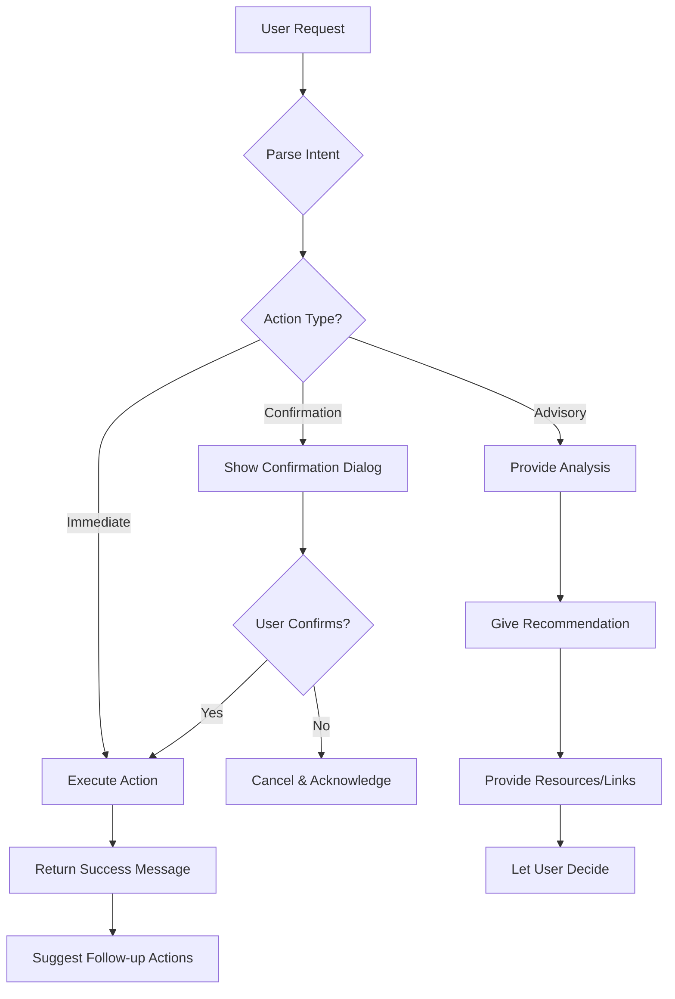

# SurfSense 2.0 - Conversational AI Crypto Advisor UX Specification

**Version:** 3.0
**Date:** 2026-02-02
**Status:** ✅ COMPLETE
**Owner:** Sally (UX Designer)

---

## Executive Summary

### The Problem

The current SurfSense 2.0 design treats crypto features as **isolated UI components** (Crypto Dashboard, Watchlist, Alerts, Portfolio) that don't work together as an integrated AI assistant. Users must navigate between screens and manually configure each feature.

### The Vision

SurfSense should function as a **true crypto advisory AI assistant** where:

1. **Conversation is the primary interface** - Users interact through natural language
2. **AI proactively helps** - Not just responding, but anticipating needs
3. **All features are tools** - Watchlist, alerts, portfolio are AI-callable tools, not separate UIs
4. **Personalization is automatic** - AI learns user's risk profile and investment style

### Core Design Principles

| Principle | Description |
|-----------|-------------|
| **Conversation-First** | Chat is the primary interface; UI components are secondary |
| **Tool-Augmented AI** | AI calls tools (DexScreener, safety check) to gather data |
| **Context-Aware** | AI uses portfolio, watchlist, chat history to personalize |
| **Action-Oriented** | AI can execute actions (add to watchlist, set alert) |
| **Proactive Intelligence** | AI monitors and alerts without being asked |

---

## Part 1: Conversational Flow Diagrams

### 1.1 Token Research Flow

**User Goal:** Research a token and decide whether to invest

```
┌─────────────────────────────────────────────────────────────────────────────┐
│                        TOKEN RESEARCH CONVERSATION                          │
├─────────────────────────────────────────────────────────────────────────────┤
│                                                                             │
│  USER: "I want to research BULLA token on Solana"                          │
│                                                                             │
│  ┌─────────────────────────────────────────────────────────────────────┐   │
│  │ 🔧 AI TOOL CALLS (Parallel)                                         │   │
│  │ ├── [1] DexScreener API → Fetch price, volume, liquidity, holders   │   │
│  │ ├── [2] Safety Analysis → Check LP lock, mint authority, honeypot   │   │
│  │ ├── [3] On-chain Metrics → Whale activity, holder distribution      │   │
│  │ └── [4] User Context → Check portfolio, watchlist, risk profile     │   │
│  └─────────────────────────────────────────────────────────────────────┘   │
│                                                                             │
│  AI: "Here's my analysis of BULLA/SOL:                                     │
│                                                                             │
│       📊 **Market Data**                                                   │
│       Price: $0.00001234 (+156% 24h)                                       │
│       Volume: $1.2M | Liquidity: $450K | MCap: $2.1M                       │
│                                                                             │
│       🛡️ **Safety Score: 65/100 (Medium Risk)**                           │
│       ✅ LP locked for 6 months                                            │
│       ✅ Contract verified on Solscan                                      │
│       ⚠️ Top 10 holders own 45% of supply                                  │
│       ⚠️ Token is only 3 days old                                          │
│                                                                             │
│       🐋 **Whale Activity**                                                │
│       • 2 large buys ($50K+) in last hour                                  │
│       • No significant sells detected                                      │
│                                                                             │
│       💡 **Personalized Recommendation**                                   │
│       Based on your moderate risk profile and current portfolio            │
│       (70% stablecoins), this could be a small speculative position.       │
│       Suggested allocation: 2-5% of portfolio.                             │
│                                                                             │
│       Would you like me to:                                                │
│       [Add to Watchlist] [Set Price Alert] [Analyze Further]"              │
│                                                                             │
│  USER: "Yes, add it to my watchlist"                                       │
│                                                                             │
│  ┌─────────────────────────────────────────────────────────────────────┐   │
│  │ 🔧 AI ACTION: add_to_watchlist(token="BULLA", chain="solana")       │   │
│  └─────────────────────────────────────────────────────────────────────┘   │
│                                                                             │
│  AI: "Done! I've added BULLA to your watchlist. ✅                         │
│                                                                             │
│       I've also set up default monitoring:                                 │
│       • Price alert if it moves ±20%                                       │
│       • Safety alert if liquidity drops >10%                               │
│       • Whale alert for transactions >$10K                                 │
│                                                                             │
│       Want me to customize these alerts?"                                  │
│                                                                             │
│  USER: "Alert me if it pumps 50% or if whales start selling"               │
│                                                                             │
│  ┌─────────────────────────────────────────────────────────────────────┐   │
│  │ 🔧 AI ACTIONS:                                                      │   │
│  │ ├── set_alert(type="price_above", threshold="+50%")                 │   │
│  │ └── set_alert(type="whale_sell", threshold="$10K")                  │   │
│  └─────────────────────────────────────────────────────────────────────┘   │
│                                                                             │
│  AI: "Perfect! I've configured:                                            │
│       🔔 Price alert: Notify when BULLA increases 50%                      │
│       🐋 Whale alert: Notify on sell transactions >$10K                    │
│                                                                             │
│       I'll keep monitoring and let you know if anything changes."          │
│                                                                             │
└─────────────────────────────────────────────────────────────────────────────┘
```

### 1.2 Proactive Alert Flow

**AI Goal:** Monitor watchlist and alert user about important events

```
┌─────────────────────────────────────────────────────────────────────────────┐
│                        PROACTIVE ALERT CONVERSATION                         │
├─────────────────────────────────────────────────────────────────────────────┤
│                                                                             │
│  [Background: AI monitoring detects significant event]                      │
│                                                                             │
│  ┌─────────────────────────────────────────────────────────────────────┐   │
│  │ 🔔 BROWSER NOTIFICATION                                             │   │
│  │ "🚨 BULLA Alert: Price increased 52% - Based on your risk profile,  │   │
│  │  you might want to take partial profits"                            │   │
│  └─────────────────────────────────────────────────────────────────────┘   │
│                                                                             │
│  [User opens SurfSense]                                                    │
│                                                                             │
│  AI: "🚨 **BULLA Alert Triggered**                                         │
│                                                                             │
│       Your BULLA position is up 52% since you added it to watchlist.       │
│                                                                             │
│       📊 Current Status:                                                   │
│       • Entry: $0.00001234 → Now: $0.00001876                              │
│       • Volume: 3x average (unusual activity)                              │
│       • Whale activity: 2 large sells detected ($25K, $18K)                │
│                                                                             │
│       ⚠️ **Risk Assessment**                                               │
│       The recent whale sells combined with the rapid price increase        │
│       suggests potential profit-taking. Based on your moderate risk        │
│       profile, I recommend:                                                │
│                                                                             │
│       💡 **Suggested Action**                                              │
│       Consider taking 50% profits to secure gains while keeping            │
│       exposure for further upside.                                         │
│                                                                             │
│       [Take Profits Guide] [Keep Watching] [Remove from Watchlist]"        │
│                                                                             │
└─────────────────────────────────────────────────────────────────────────────┘
```

### 1.3 Portfolio Analysis Flow

**User Goal:** Understand portfolio performance and get recommendations

```
┌─────────────────────────────────────────────────────────────────────────────┐
│                      PORTFOLIO ANALYSIS CONVERSATION                        │
├─────────────────────────────────────────────────────────────────────────────┤
│                                                                             │
│  USER: "How's my portfolio doing?"                                         │
│                                                                             │
│  ┌─────────────────────────────────────────────────────────────────────┐   │
│  │ 🔧 AI TOOL CALLS                                                    │   │
│  │ ├── [1] get_portfolio() → Fetch all holdings                        │   │
│  │ ├── [2] get_prices(tokens) → Current prices for all tokens          │   │
│  │ ├── [3] get_user_profile() → Risk tolerance, goals                  │   │
│  │ └── [4] analyze_performance() → P&L, allocation analysis            │   │
│  └─────────────────────────────────────────────────────────────────────┘   │
│                                                                             │
│  AI: "📊 **Portfolio Summary**                                             │
│                                                                             │
│       Total Value: $15,234 (+29.34% all-time)                              │
│       24h Change: +$1,245 (+8.9%)                                          │
│                                                                             │
│       🏆 **Top Performers**                                                │
│       1. BULLA: +156% ($2,340)                                             │
│       2. BONK: +45% ($1,890)                                               │
│       3. WIF: +23% ($3,450)                                                │
│                                                                             │
│       📉 **Underperformers**                                               │
│       1. DEGEN: -15% ($890)                                                │
│                                                                             │
│       ⚖️ **Allocation Analysis**                                           │
│       Your portfolio is 85% memecoins, 15% stablecoins.                    │
│       This is higher risk than your stated 'moderate' profile.             │
│                                                                             │
│       💡 **Recommendations**                                               │
│       1. Consider taking profits on BULLA (up 156%)                        │
│       2. DEGEN has weak fundamentals - consider cutting losses             │
│       3. Increase stablecoin allocation to 30% for balance                 │
│                                                                             │
│       Want me to elaborate on any of these?"                               │
│                                                                             │
└─────────────────────────────────────────────────────────────────────────────┘
```

### 1.4 Quick Command Flow

**User Goal:** Execute quick actions via natural language

```
┌─────────────────────────────────────────────────────────────────────────────┐
│                         QUICK COMMAND EXAMPLES                              │
├─────────────────────────────────────────────────────────────────────────────┤
│                                                                             │
│  USER: "What's hot on Solana right now?"                                   │
│  AI: [Calls get_trending_tokens(chain="solana")]                           │
│      "Here are the top trending Solana tokens in the last hour..."         │
│                                                                             │
│  ─────────────────────────────────────────────────────────────────────────  │
│                                                                             │
│  USER: "Remove DEGEN from my watchlist"                                    │
│  AI: [Calls remove_from_watchlist(token="DEGEN")]                          │
│      "Done! DEGEN has been removed from your watchlist."                   │
│                                                                             │
│  ─────────────────────────────────────────────────────────────────────────  │
│                                                                             │
│  USER: "Show me tokens with unusual volume"                                │
│  AI: [Calls detect_volume_anomalies()]                                     │
│      "I found 3 tokens with unusual volume spikes..."                      │
│                                                                             │
│  ─────────────────────────────────────────────────────────────────────────  │
│                                                                             │
│  USER: "Is 0x7xKX...3nPq safe?"                                            │
│  AI: [Calls safety_check(contract="0x7xKX...3nPq")]                        │
│      "Let me analyze this contract... Safety Score: 45/100 (High Risk)"    │
│                                                                             │
└─────────────────────────────────────────────────────────────────────────────┘
```

---

## Part 2: Tool Calling Architecture

### 2.1 Tool Categories

The AI assistant has access to the following tool categories:

```
┌─────────────────────────────────────────────────────────────────────────────┐
│                           AI TOOL ARCHITECTURE                              │
├─────────────────────────────────────────────────────────────────────────────┤
│                                                                             │
│  ┌─────────────────────────────────────────────────────────────────────┐   │
│  │ 📊 DATA RETRIEVAL TOOLS                                             │   │
│  │ ├── get_token_info(token, chain)      → Price, volume, liquidity    │   │
│  │ ├── get_token_holders(token, chain)   → Holder distribution         │   │
│  │ ├── get_trending_tokens(chain, limit) → Hot tokens                  │   │
│  │ ├── get_whale_activity(token, chain)  → Large transactions          │   │
│  │ └── get_market_overview()             → BTC, ETH, SOL prices        │   │
│  └─────────────────────────────────────────────────────────────────────┘   │
│                                                                             │
│  ┌─────────────────────────────────────────────────────────────────────┐   │
│  │ 🛡️ ANALYSIS TOOLS                                                   │   │
│  │ ├── safety_check(contract, chain)     → Rug pull risk analysis      │   │
│  │ ├── analyze_holders(token, chain)     → Concentration risk          │   │
│  │ ├── detect_anomalies(token, chain)    → Unusual patterns            │   │
│  │ └── predict_trend(token, chain)       → AI price prediction         │   │
│  └─────────────────────────────────────────────────────────────────────┘   │
│                                                                             │
│  ┌─────────────────────────────────────────────────────────────────────┐   │
│  │ 📋 PORTFOLIO TOOLS                                                  │   │
│  │ ├── get_portfolio()                   → User's holdings             │   │
│  │ ├── get_watchlist()                   → Watched tokens              │   │
│  │ ├── get_alerts()                      → Active alerts               │   │
│  │ └── get_user_profile()                → Risk profile, preferences   │   │
│  └─────────────────────────────────────────────────────────────────────┘   │
│                                                                             │
│  ┌─────────────────────────────────────────────────────────────────────┐   │
│  │ ⚡ ACTION TOOLS                                                      │   │
│  │ ├── add_to_watchlist(token, chain)    → Add token to watchlist      │   │
│  │ ├── remove_from_watchlist(token)      → Remove from watchlist       │   │
│  │ ├── set_alert(type, token, config)    → Create price/whale alert    │   │
│  │ ├── delete_alert(alert_id)            → Remove alert                │   │
│  │ └── update_user_profile(preferences)  → Update risk profile         │   │
│  └─────────────────────────────────────────────────────────────────────┘   │
│                                                                             │
└─────────────────────────────────────────────────────────────────────────────┘
```

### 2.2 Tool Definitions (OpenAI Function Calling Format)

```typescript
// Tool: get_token_info
{
  name: "get_token_info",
  description: "Fetch real-time token data from DexScreener including price, volume, liquidity, and market cap",
  parameters: {
    type: "object",
    properties: {
      token: {
        type: "string",
        description: "Token symbol (e.g., 'BULLA') or contract address"
      },
      chain: {
        type: "string",
        enum: ["solana", "ethereum", "base", "arbitrum", "polygon", "bsc"],
        description: "Blockchain network"
      }
    },
    required: ["token", "chain"]
  }
}

// Tool: safety_check
{
  name: "safety_check",
  description: "Analyze a token contract for rug pull risks, honeypot detection, and safety score",
  parameters: {
    type: "object",
    properties: {
      contract: {
        type: "string",
        description: "Contract address to analyze"
      },
      chain: {
        type: "string",
        enum: ["solana", "ethereum", "base", "arbitrum", "polygon", "bsc"]
      }
    },
    required: ["contract", "chain"]
  }
}

// Tool: add_to_watchlist
{
  name: "add_to_watchlist",
  description: "Add a token to the user's watchlist for monitoring",
  parameters: {
    type: "object",
    properties: {
      token: { type: "string", description: "Token symbol or contract" },
      chain: { type: "string" },
      set_default_alerts: {
        type: "boolean",
        default: true,
        description: "Whether to set up default price and safety alerts"
      }
    },
    required: ["token", "chain"]
  }
}

// Tool: set_alert
{
  name: "set_alert",
  description: "Create a price, volume, whale, or safety alert for a token",
  parameters: {
    type: "object",
    properties: {
      token: { type: "string" },
      chain: { type: "string" },
      alert_type: {
        type: "string",
        enum: ["price_above", "price_below", "price_change", "volume_spike",
               "whale_buy", "whale_sell", "liquidity_change", "safety_drop"]
      },
      threshold: { type: "string", description: "e.g., '+50%', '$10000', '10%'" },
      notification_channels: {
        type: "array",
        items: { type: "string", enum: ["browser", "email", "telegram"] },
        default: ["browser"]
      }
    },
    required: ["token", "chain", "alert_type", "threshold"]
  }
}
```


---

## Part 3: Context Management System

### 3.1 Context Layers

The AI maintains multiple layers of context to personalize responses:

```
┌─────────────────────────────────────────────────────────────────────────────┐
│                         CONTEXT MANAGEMENT LAYERS                           │
├─────────────────────────────────────────────────────────────────────────────┤
│                                                                             │
│  ┌─────────────────────────────────────────────────────────────────────┐   │
│  │ LAYER 1: IMMEDIATE CONTEXT (Current Session)                        │   │
│  │ ├── Current page context (DexScreener token being viewed)           │   │
│  │ ├── Current conversation thread                                     │   │
│  │ ├── Recently mentioned tokens                                       │   │
│  │ └── User's current intent/goal                                      │   │
│  └─────────────────────────────────────────────────────────────────────┘   │
│                           ↓                                                 │
│  ┌─────────────────────────────────────────────────────────────────────┐   │
│  │ LAYER 2: USER PROFILE (Persistent)                                  │   │
│  │ ├── Risk tolerance: Conservative / Moderate / Aggressive            │   │
│  │ ├── Investment style: Day trader / Swing / Long-term                │   │
│  │ ├── Preferred chains: Solana, Base, Ethereum                        │   │
│  │ ├── Portfolio size range: Small (<$1K) / Medium / Large (>$100K)    │   │
│  │ └── Notification preferences                                        │   │
│  └─────────────────────────────────────────────────────────────────────┘   │
│                           ↓                                                 │
│  ┌─────────────────────────────────────────────────────────────────────┐   │
│  │ LAYER 3: PORTFOLIO CONTEXT (Real-time)                              │   │
│  │ ├── Current holdings (tokens, amounts, entry prices)                │   │
│  │ ├── Watchlist tokens                                                │   │
│  │ ├── Active alerts                                                   │   │
│  │ ├── P&L history                                                     │   │
│  │ └── Past trades (wins/losses patterns)                              │   │
│  └─────────────────────────────────────────────────────────────────────┘   │
│                           ↓                                                 │
│  ┌─────────────────────────────────────────────────────────────────────┐   │
│  │ LAYER 4: BEHAVIORAL CONTEXT (Learned)                               │   │
│  │ ├── Tokens user typically researches                                │   │
│  │ ├── Alert response patterns (acts on alerts? ignores?)              │   │
│  │ ├── Risk decisions history                                          │   │
│  │ ├── Preferred analysis depth (quick vs detailed)                    │   │
│  │ └── Active hours (when user is typically online)                    │   │
│  └─────────────────────────────────────────────────────────────────────┘   │
│                                                                             │
└─────────────────────────────────────────────────────────────────────────────┘
```

### 3.2 Context Injection into Prompts

```typescript
// System prompt template with context injection
const systemPrompt = `
You are SurfSense, an AI crypto advisor assistant.

## User Profile
- Risk Tolerance: ${userProfile.riskTolerance}
- Investment Style: ${userProfile.investmentStyle}
- Preferred Chains: ${userProfile.preferredChains.join(", ")}
- Portfolio Size: ${userProfile.portfolioSizeRange}

## Current Portfolio
${portfolio.holdings.map(h => `- ${h.token}: ${h.amount} ($${h.value})`).join("\n")}
Total Value: $${portfolio.totalValue}

## Watchlist
${watchlist.map(w => `- ${w.token} (${w.chain}): $${w.price} ${w.change24h}`).join("\n")}

## Active Alerts
${alerts.map(a => `- ${a.token}: ${a.type} at ${a.threshold}`).join("\n")}

## Current Page Context
${pageContext ? `User is viewing: ${pageContext.token} on ${pageContext.chain}` : "No specific page context"}

## Behavioral Insights
- User typically ${behaviorInsights.riskPattern}
- Prefers ${behaviorInsights.analysisDepth} analysis
- Usually active during ${behaviorInsights.activeHours}

## Instructions
1. Always consider user's risk profile when making recommendations
2. Reference their portfolio when relevant
3. Be proactive about potential risks
4. Suggest actions (add to watchlist, set alert) when appropriate
5. Use their preferred chains as default when searching
`;
```

### 3.3 Personalization Examples

| User Profile | AI Response Adaptation |
|--------------|------------------------|
| **Conservative + Small Portfolio** | "This token is high risk. Given your conservative profile and portfolio size, I'd recommend watching from the sidelines or allocating max 1%." |
| **Aggressive + Large Portfolio** | "This looks like a high-risk, high-reward play. With your risk tolerance, you could consider a 5-10% allocation with tight stop-losses." |
| **Day Trader** | Focus on short-term signals, volume patterns, entry/exit points |
| **Long-term Holder** | Focus on fundamentals, team, roadmap, long-term potential |

---

## Part 4: Action Execution Patterns

### 4.1 Action Types

```
┌─────────────────────────────────────────────────────────────────────────────┐
│                           ACTION EXECUTION TYPES                            │
├─────────────────────────────────────────────────────────────────────────────┤
│                                                                             │
│  ┌─────────────────────────────────────────────────────────────────────┐   │
│  │ TYPE 1: IMMEDIATE ACTIONS (Auto-execute)                            │   │
│  │ Actions that are safe to execute immediately without confirmation   │   │
│  │                                                                     │   │
│  │ • Add to watchlist                                                  │   │
│  │ • Remove from watchlist                                             │   │
│  │ • Set/modify alerts                                                 │   │
│  │ • Update preferences                                                │   │
│  │ • Save page to knowledge base                                       │   │
│  │                                                                     │   │
│  │ Example:                                                            │   │
│  │ User: "Add BULLA to my watchlist"                                   │   │
│  │ AI: [Executes immediately] "Done! BULLA added to watchlist. ✅"     │   │
│  └─────────────────────────────────────────────────────────────────────┘   │
│                                                                             │
│  ┌─────────────────────────────────────────────────────────────────────┐   │
│  │ TYPE 2: CONFIRMATION ACTIONS (Require user confirmation)            │   │
│  │ Actions that have significant impact and need explicit approval     │   │
│  │                                                                     │   │
│  │ • Delete all alerts for a token                                     │   │
│  │ • Clear watchlist                                                   │   │
│  │ • Change risk profile                                               │   │
│  │                                                                     │   │
│  │ Example:                                                            │   │
│  │ User: "Clear my watchlist"                                          │   │
│  │ AI: "You have 15 tokens in your watchlist. Are you sure you want    │   │
│  │      to remove all of them? [Yes, clear all] [Cancel]"              │   │
│  └─────────────────────────────────────────────────────────────────────┘   │
│                                                                             │
│  ┌─────────────────────────────────────────────────────────────────────┐   │
│  │ TYPE 3: ADVISORY ACTIONS (AI suggests, user decides)                │   │
│  │ Financial decisions that AI should NEVER auto-execute               │   │
│  │                                                                     │   │
│  │ • Buy/Sell recommendations                                          │   │
│  │ • Take profit suggestions                                           │   │
│  │ • Cut loss recommendations                                          │   │
│  │                                                                     │   │
│  │ Example:                                                            │   │
│  │ User: "Should I sell my BULLA?"                                     │   │
│  │ AI: "Based on the 156% gain and recent whale sells, taking partial  │   │
│  │      profits could be wise. However, this is your decision.         │   │
│  │      Here's a guide on how to sell on Raydium: [Link]"              │   │
│  │                                                                     │   │
│  │ ⚠️ AI NEVER executes trades or moves funds                          │   │
│  └─────────────────────────────────────────────────────────────────────┘   │
│                                                                             │
└─────────────────────────────────────────────────────────────────────────────┘
```

### 4.2 Action Execution Flow



### 4.3 Smart Follow-up Suggestions

After executing an action, AI proactively suggests related actions:

| Action Completed | Follow-up Suggestions |
|------------------|----------------------|
| Added to watchlist | "Want me to set up price alerts?" |
| Set price alert | "Should I also monitor whale activity?" |
| Safety check (risky) | "I'd recommend NOT adding this to watchlist. Want me to find safer alternatives?" |
| Safety check (safe) | "This looks good! Add to watchlist?" |
| Portfolio analysis | "Want me to set alerts for your underperformers?" |

---

## Part 5: Proactive Monitoring Design

### 5.1 Background Monitoring Architecture

```
┌─────────────────────────────────────────────────────────────────────────────┐
│                      PROACTIVE MONITORING SYSTEM                            │
├─────────────────────────────────────────────────────────────────────────────┤
│                                                                             │
│  ┌─────────────────────────────────────────────────────────────────────┐   │
│  │ BACKEND MONITORING SERVICE (Always Running)                         │   │
│  │                                                                     │   │
│  │  ┌─────────────┐    ┌─────────────┐    ┌─────────────┐             │   │
│  │  │ Price       │    │ Whale       │    │ Safety      │             │   │
│  │  │ Monitor     │    │ Monitor     │    │ Monitor     │             │   │
│  │  │ (30s poll)  │    │ (1m poll)   │    │ (5m poll)   │             │   │
│  │  └──────┬──────┘    └──────┬──────┘    └──────┬──────┘             │   │
│  │         │                  │                  │                     │   │
│  │         └──────────────────┼──────────────────┘                     │   │
│  │                            ↓                                        │   │
│  │                   ┌─────────────────┐                               │   │
│  │                   │ Alert Evaluator │                               │   │
│  │                   │ (Check triggers)│                               │   │
│  │                   └────────┬────────┘                               │   │
│  │                            ↓                                        │   │
│  │                   ┌─────────────────┐                               │   │
│  │                   │ Context Engine  │                               │   │
│  │                   │ (Add user ctx)  │                               │   │
│  │                   └────────┬────────┘                               │   │
│  │                            ↓                                        │   │
│  │                   ┌─────────────────┐                               │   │
│  │                   │ AI Personalizer │                               │   │
│  │                   │ (Generate msg)  │                               │   │
│  │                   └────────┬────────┘                               │   │
│  │                            ↓                                        │   │
│  │                   ┌─────────────────┐                               │   │
│  │                   │ Notification    │                               │   │
│  │                   │ Dispatcher      │                               │   │
│  │                   └─────────────────┘                               │   │
│  └─────────────────────────────────────────────────────────────────────┘   │
│                                                                             │
│  ┌─────────────────────────────────────────────────────────────────────┐   │
│  │ NOTIFICATION CHANNELS                                               │   │
│  │                                                                     │   │
│  │  ┌─────────────┐    ┌─────────────┐    ┌─────────────┐             │   │
│  │  │ Browser     │    │ Email       │    │ Telegram    │             │   │
│  │  │ Push        │    │ Digest      │    │ Bot         │             │   │
│  │  └─────────────┘    └─────────────┘    └─────────────┘             │   │
│  └─────────────────────────────────────────────────────────────────────┘   │
│                                                                             │
└─────────────────────────────────────────────────────────────────────────────┘
```

### 5.2 Alert Types & Triggers

| Alert Type | Trigger Condition | AI Enhancement |
|------------|-------------------|----------------|
| **Price Alert** | Price crosses threshold | "BULLA hit your $0.00002 target. Based on momentum, it might go higher. Consider trailing stop?" |
| **Volume Spike** | Volume > 3x average | "Unusual volume on BULLA. Checking whale activity... 2 large buys detected. Could be accumulation." |
| **Whale Alert** | Transaction > $10K | "Whale sold $50K BULLA. This is 5% of liquidity. Consider your position." |
| **Safety Alert** | Risk score drops | "⚠️ BULLA safety score dropped from 72 to 45. LP unlock detected. Recommend caution." |
| **Liquidity Alert** | Liquidity change > 10% | "Liquidity on BULLA decreased 15%. This increases slippage risk." |

### 5.3 Smart Notification Batching

To avoid notification fatigue, AI batches and prioritizes alerts:

```
┌─────────────────────────────────────────────────────────────────────────────┐
│                      NOTIFICATION BATCHING LOGIC                            │
├─────────────────────────────────────────────────────────────────────────────┤
│                                                                             │
│  Priority Levels:                                                          │
│  🔴 CRITICAL: Immediate push (rug pull warning, massive price drop)        │
│  🟠 HIGH: Push within 1 minute (price target hit, whale activity)          │
│  🟡 MEDIUM: Batch every 15 minutes (volume spikes, minor alerts)           │
│  🟢 LOW: Daily digest (market overview, portfolio summary)                 │
│                                                                             │
│  Batching Example:                                                         │
│  ─────────────────────────────────────────────────────────────────────────  │
│  Instead of 5 separate notifications:                                      │
│  • BULLA +10%                                                              │
│  • BONK +5%                                                                │
│  • PEPE -3%                                                                │
│  • WIF +8%                                                                 │
│  • DEGEN -2%                                                               │
│                                                                             │
│  AI sends 1 batched notification:                                          │
│  "📊 Watchlist Update: 3 tokens up, 2 down. BULLA leading (+10%).          │
│   Your portfolio is +$234 (+2.1%) in the last hour."                       │
│                                                                             │
└─────────────────────────────────────────────────────────────────────────────┘
```


---

## Part 6: Integrated Chat Wireframes

### 6.1 Main Chat Interface with Embedded Crypto Widgets

```
┌─────────────────────────────────────────────────────────────────────────────┐
│ 🧠 SurfSense                                    [Search Space ▼] [⚙️] [👤] │
├─────────────────────────────────────────────────────────────────────────────┤
│                                                                             │
│  ┌─────────────────────────────────────────────────────────────────────┐   │
│  │ 📍 PAGE CONTEXT BAR (Auto-detected)                                 │   │
│  │ You're viewing: BULLA/SOL on DexScreener                           │   │
│  │ $0.00001234 (+156%) | Vol: $1.2M | Liq: $450K                       │   │
│  │ [Analyze] [Add to Watchlist] [Set Alert]                           │   │
│  └─────────────────────────────────────────────────────────────────────┘   │
│                                                                             │
│  ┌─────────────────────────────────────────────────────────────────────┐   │
│  │ 💬 CONVERSATION                                                     │   │
│  │                                                                     │   │
│  │  🧠 AI: Good morning! I noticed you're looking at BULLA.            │   │
│  │      Here's what I found:                                           │   │
│  │                                                                     │   │
│  │      ┌─────────────────────────────────────────────────────────┐   │   │
│  │      │ 📊 BULLA/SOL Analysis                                   │   │   │
│  │      │ ━━━━━━━━━━━━━━━━━━━━━━━━━━━━━━━━━━━━━━━━━━━━━━━━━━━━━━ │   │   │
│  │      │ Price: $0.00001234  │  24h: +156%  │  MCap: $2.1M       │   │   │
│  │      │ Volume: $1.2M       │  Liq: $450K  │  Age: 3 days       │   │   │
│  │      │ ━━━━━━━━━━━━━━━━━━━━━━━━━━━━━━━━━━━━━━━━━━━━━━━━━━━━━━ │   │   │
│  │      │ 🛡️ Safety: 65/100 (Medium Risk)                         │   │   │
│  │      │ ✅ LP locked  ⚠️ Top 10 own 45%  ⚠️ Very new            │   │   │
│  │      │ ━━━━━━━━━━━━━━━━━━━━━━━━━━━━━━━━━━━━━━━━━━━━━━━━━━━━━━ │   │   │
│  │      │ [➕ Add to Watchlist] [🔔 Set Alert] [📊 Full Analysis] │   │   │
│  │      └─────────────────────────────────────────────────────────┘   │   │
│  │                                                                     │   │
│  │      Based on your moderate risk profile, this could be a small    │   │
│  │      speculative position (2-5% of portfolio).                     │   │
│  │                                                                     │   │
│  │  👤 You: Add it to my watchlist and alert me at +50%               │   │
│  │                                                                     │   │
│  │  🧠 AI: Done! ✅                                                    │   │
│  │      • Added BULLA to watchlist                                    │   │
│  │      • Set price alert at +50% ($0.00001851)                       │   │
│  │      • Also set safety alert (liquidity drop >10%)                 │   │
│  │                                                                     │   │
│  │      ┌─────────────────────────────────────────────────────────┐   │   │
│  │      │ ✅ Actions Completed                                    │   │   │
│  │      │ • BULLA added to watchlist                              │   │   │
│  │      │ • Price alert: +50% ($0.00001851)                       │   │   │
│  │      │ • Safety alert: Liquidity drop >10%                     │   │   │
│  │      │ [View Watchlist] [Edit Alerts]                          │   │   │
│  │      └─────────────────────────────────────────────────────────┘   │   │
│  │                                                                     │   │
│  └─────────────────────────────────────────────────────────────────────┘   │
│                                                                             │
│  ┌─────────────────────────────────────────────────────────────────────┐   │
│  │ 💡 SUGGESTIONS                                                      │   │
│  │ [What's trending on Solana?] [Check my portfolio] [Show watchlist] │   │
│  └─────────────────────────────────────────────────────────────────────┘   │
│                                                                             │
│  ┌─────────────────────────────────────────────────────────────────────┐   │
│  │ [📎] Type a message...                                    [Send ➤] │   │
│  └─────────────────────────────────────────────────────────────────────┘   │
│                                                                             │
└─────────────────────────────────────────────────────────────────────────────┘
```

### 6.2 Proactive Alert in Chat

```
┌─────────────────────────────────────────────────────────────────────────────┐
│ 💬 CONVERSATION (with proactive alert)                                      │
├─────────────────────────────────────────────────────────────────────────────┤
│                                                                             │
│  🔔 NEW ALERT                                                              │
│  ┌─────────────────────────────────────────────────────────────────────┐   │
│  │ 🚨 BULLA ALERT TRIGGERED                                           │   │
│  │ ━━━━━━━━━━━━━━━━━━━━━━━━━━━━━━━━━━━━━━━━━━━━━━━━━━━━━━━━━━━━━━━━━ │   │
│  │ Your +50% price target was hit!                                    │   │
│  │                                                                     │   │
│  │ Entry: $0.00001234 → Now: $0.00001876 (+52%)                       │   │
│  │                                                                     │   │
│  │ ⚠️ Risk Assessment:                                                 │   │
│  │ • 2 whale sells detected ($25K, $18K)                              │   │
│  │ • Volume 3x average (unusual activity)                             │   │
│  │                                                                     │   │
│  │ 💡 Recommendation: Consider taking 50% profits                     │   │
│  │                                                                     │   │
│  │ [Take Profits Guide] [Keep Watching] [Dismiss]                     │   │
│  └─────────────────────────────────────────────────────────────────────┘   │
│                                                                             │
│  👤 You: What do you think I should do?                                    │
│                                                                             │
│  🧠 AI: Based on your moderate risk profile and the whale activity,        │
│      I'd suggest taking partial profits (50%) to secure gains while        │
│      keeping exposure for further upside.                                  │
│                                                                             │
│      Here's a quick guide to sell on Raydium:                              │
│      1. Go to raydium.io/swap                                              │
│      2. Connect your wallet                                                │
│      3. Select BULLA → SOL                                                 │
│      4. Enter amount (50% of your holdings)                                │
│                                                                             │
│      ⚠️ Remember: This is not financial advice. The decision is yours.    │
│                                                                             │
└─────────────────────────────────────────────────────────────────────────────┘
```

### 6.3 Inline Watchlist View

```
┌─────────────────────────────────────────────────────────────────────────────┐
│ 💬 CONVERSATION                                                             │
├─────────────────────────────────────────────────────────────────────────────┤
│                                                                             │
│  👤 You: Show my watchlist                                                 │
│                                                                             │
│  🧠 AI: Here's your watchlist (5 tokens):                                  │
│                                                                             │
│  ┌─────────────────────────────────────────────────────────────────────┐   │
│  │ 📋 YOUR WATCHLIST                                                   │   │
│  │ ━━━━━━━━━━━━━━━━━━━━━━━━━━━━━━━━━━━━━━━━━━━━━━━━━━━━━━━━━━━━━━━━━ │   │
│  │                                                                     │   │
│  │ 🟢 BULLA    $0.00001876  +52.0%   🛡️ 65   [Analyze] [Remove]       │   │
│  │ 🟢 BONK     $0.00002156  +12.3%   🛡️ 89   [Analyze] [Remove]       │   │
│  │ 🟢 PEPE     $0.00001089   +8.7%   🛡️ 85   [Analyze] [Remove]       │   │
│  │ 🔴 WIF      $2.45        -5.2%    🛡️ 94   [Analyze] [Remove]       │   │
│  │ 🔴 DEGEN    $0.0156     -15.3%    🛡️ 78   [Analyze] [Remove]       │   │
│  │                                                                     │   │
│  │ ━━━━━━━━━━━━━━━━━━━━━━━━━━━━━━━━━━━━━━━━━━━━━━━━━━━━━━━━━━━━━━━━━ │   │
│  │ Total Watchlist Value: $4,567 (+8.2% today)                        │   │
│  │ [Add Token] [Manage Alerts] [Export]                               │   │
│  └─────────────────────────────────────────────────────────────────────┘   │
│                                                                             │
│      📊 Summary: 3 tokens up, 2 down. BULLA is your top performer.        │
│      ⚠️ DEGEN is down 15% - want me to analyze why?                       │
│                                                                             │
│  👤 You: Yes, what's happening with DEGEN?                                 │
│                                                                             │
│  🧠 AI: Let me check DEGEN...                                              │
│                                                                             │
│  ┌─────────────────────────────────────────────────────────────────────┐   │
│  │ 🔍 DEGEN ANALYSIS                                                   │   │
│  │ ━━━━━━━━━━━━━━━━━━━━━━━━━━━━━━━━━━━━━━━━━━━━━━━━━━━━━━━━━━━━━━━━━ │   │
│  │ Price: $0.0156 (-15.3% 24h)                                        │   │
│  │                                                                     │   │
│  │ 📉 Why it's dropping:                                               │   │
│  │ • Large whale sold $120K (3% of liquidity)                         │   │
│  │ • Overall market sentiment bearish                                 │   │
│  │ • No recent news or updates from team                              │   │
│  │                                                                     │   │
│  │ 🛡️ Safety: 78/100 (Still relatively safe)                          │   │
│  │ • LP still locked ✅                                                │   │
│  │ • No suspicious activity detected ✅                                │   │
│  │                                                                     │   │
│  │ 💡 Recommendation: Hold or cut losses based on your entry price    │   │
│  │ [Set Stop-Loss Alert] [Remove from Watchlist]                      │   │
│  └─────────────────────────────────────────────────────────────────────┘   │
│                                                                             │
└─────────────────────────────────────────────────────────────────────────────┘
```


---

## Part 7: Implementation Recommendations

### 7.1 Backend API Endpoints for Tool Calling

```typescript
// Required API endpoints for AI tool calling

// Data Retrieval Endpoints
GET  /api/v1/crypto/token/{chain}/{address}     // get_token_info
GET  /api/v1/crypto/token/{chain}/{address}/holders  // get_token_holders
GET  /api/v1/crypto/trending/{chain}            // get_trending_tokens
GET  /api/v1/crypto/whales/{chain}/{address}    // get_whale_activity
GET  /api/v1/crypto/market-overview             // get_market_overview

// Analysis Endpoints
POST /api/v1/crypto/safety-check                // safety_check
POST /api/v1/crypto/analyze-holders             // analyze_holders
POST /api/v1/crypto/detect-anomalies            // detect_anomalies
POST /api/v1/crypto/predict-trend               // predict_trend

// Portfolio Endpoints
GET  /api/v1/user/portfolio                     // get_portfolio
GET  /api/v1/user/watchlist                     // get_watchlist
GET  /api/v1/user/alerts                        // get_alerts
GET  /api/v1/user/profile                       // get_user_profile

// Action Endpoints
POST /api/v1/user/watchlist                     // add_to_watchlist
DELETE /api/v1/user/watchlist/{token_id}        // remove_from_watchlist
POST /api/v1/user/alerts                        // set_alert
DELETE /api/v1/user/alerts/{alert_id}           // delete_alert
PATCH /api/v1/user/profile                      // update_user_profile
```

### 7.2 LangGraph Tool Integration

```python
# Backend: LangGraph tool definitions

from langchain_core.tools import tool
from typing import Literal

@tool
def get_token_info(
    token: str,
    chain: Literal["solana", "ethereum", "base", "arbitrum", "polygon", "bsc"]
) -> dict:
    """Fetch real-time token data from DexScreener including price, volume, liquidity."""
    # Call DexScreener API
    return dexscreener_client.get_token(token, chain)

@tool
def safety_check(
    contract: str,
    chain: Literal["solana", "ethereum", "base", "arbitrum", "polygon", "bsc"]
) -> dict:
    """Analyze a token contract for rug pull risks and safety score."""
    # Run safety analysis
    return safety_analyzer.analyze(contract, chain)

@tool
def add_to_watchlist(
    token: str,
    chain: str,
    user_id: str,
    set_default_alerts: bool = True
) -> dict:
    """Add a token to user's watchlist."""
    result = watchlist_service.add(user_id, token, chain)
    if set_default_alerts:
        alert_service.create_default_alerts(user_id, token, chain)
    return result

@tool
def set_alert(
    token: str,
    chain: str,
    alert_type: Literal["price_above", "price_below", "price_change",
                        "volume_spike", "whale_buy", "whale_sell",
                        "liquidity_change", "safety_drop"],
    threshold: str,
    user_id: str
) -> dict:
    """Create a price, volume, whale, or safety alert for a token."""
    return alert_service.create(user_id, token, chain, alert_type, threshold)

# LangGraph StateGraph with tools
from langgraph.graph import StateGraph, END

tools = [get_token_info, safety_check, add_to_watchlist, set_alert, ...]

def create_crypto_advisor_graph():
    graph = StateGraph(AgentState)

    # Add nodes
    graph.add_node("agent", agent_node)
    graph.add_node("tools", tool_node)

    # Add edges
    graph.add_edge("agent", "tools")
    graph.add_edge("tools", "agent")
    graph.add_conditional_edges("agent", should_continue, {True: "tools", False: END})

    return graph.compile()
```

### 7.3 Frontend Chat Component Architecture

```typescript
// Frontend: Chat component with tool UI rendering

interface ChatMessage {
  id: string;
  role: 'user' | 'assistant';
  content: string;
  toolCalls?: ToolCall[];
  toolResults?: ToolResult[];
  embeddedWidgets?: EmbeddedWidget[];
}

interface EmbeddedWidget {
  type: 'token_analysis' | 'watchlist' | 'alert_config' | 'action_confirmation';
  data: any;
  actions?: WidgetAction[];
}

// Chat component with embedded widgets
const ChatMessage: React.FC<{ message: ChatMessage }> = ({ message }) => {
  return (
    <div className="chat-message">
      {/* Text content */}
      <div className="message-content">{message.content}</div>

      {/* Embedded widgets */}
      {message.embeddedWidgets?.map((widget, i) => (
        <EmbeddedWidget key={i} widget={widget} />
      ))}

      {/* Action buttons */}
      {message.suggestedActions && (
        <SuggestedActions actions={message.suggestedActions} />
      )}
    </div>
  );
};

// Embedded widget renderer
const EmbeddedWidget: React.FC<{ widget: EmbeddedWidget }> = ({ widget }) => {
  switch (widget.type) {
    case 'token_analysis':
      return <TokenAnalysisCard data={widget.data} actions={widget.actions} />;
    case 'watchlist':
      return <WatchlistTable data={widget.data} actions={widget.actions} />;
    case 'alert_config':
      return <AlertConfigCard data={widget.data} actions={widget.actions} />;
    case 'action_confirmation':
      return <ActionConfirmation data={widget.data} actions={widget.actions} />;
    default:
      return null;
  }
};
```

### 7.4 Context Management Implementation

```typescript
// Context service for AI personalization

interface UserContext {
  // Layer 1: Immediate
  currentPage: PageContext | null;
  conversationHistory: Message[];
  recentTokens: string[];

  // Layer 2: User Profile
  profile: {
    riskTolerance: 'conservative' | 'moderate' | 'aggressive';
    investmentStyle: 'day_trader' | 'swing' | 'long_term';
    preferredChains: string[];
    portfolioSizeRange: 'small' | 'medium' | 'large';
  };

  // Layer 3: Portfolio
  portfolio: {
    holdings: Holding[];
    totalValue: number;
  };
  watchlist: WatchlistToken[];
  alerts: Alert[];

  // Layer 4: Behavioral
  behavior: {
    researchPatterns: string[];
    alertResponseRate: number;
    riskDecisions: RiskDecision[];
    preferredAnalysisDepth: 'quick' | 'detailed';
    activeHours: string;
  };
}

// Build system prompt with context
function buildSystemPrompt(context: UserContext): string {
  return `
You are SurfSense, an AI crypto advisor assistant.

## User Profile
- Risk Tolerance: ${context.profile.riskTolerance}
- Investment Style: ${context.profile.investmentStyle}
- Preferred Chains: ${context.profile.preferredChains.join(", ")}

## Current Portfolio
${context.portfolio.holdings.map(h => `- ${h.token}: $${h.value}`).join("\n")}
Total: $${context.portfolio.totalValue}

## Watchlist (${context.watchlist.length} tokens)
${context.watchlist.slice(0, 5).map(w => `- ${w.token}: ${w.change24h}`).join("\n")}

## Current Page
${context.currentPage ? `Viewing: ${context.currentPage.token} on ${context.currentPage.chain}` : "No page context"}

## Instructions
1. Consider user's ${context.profile.riskTolerance} risk profile in recommendations
2. Reference their portfolio when relevant
3. Be proactive about risks
4. Suggest actions when appropriate
`;
}
```


---

## Part 8: Migration Strategy

### 8.1 Current State vs Target State

```
┌─────────────────────────────────────────────────────────────────────────────┐
│                         MIGRATION OVERVIEW                                   │
├─────────────────────────────────────────────────────────────────────────────┤
│                                                                             │
│  CURRENT STATE (v2.0 Prototype)          TARGET STATE (v2.0 Final)         │
│  ─────────────────────────────────       ─────────────────────────────     │
│                                                                             │
│  ┌─────────────────────────────┐         ┌─────────────────────────────┐   │
│  │ Sidebar Navigation         │         │ Unified Chat Interface      │   │
│  │ ├── New Chat               │         │ ├── Chat (Primary)          │   │
│  │ ├── Inbox                  │   →     │ │   ├── Embedded Widgets    │   │
│  │ ├── Documents              │         │ │   ├── Inline Actions      │   │
│  │ └── Crypto Dashboard ❌    │         │ │   └── Proactive Alerts    │   │
│  │     ├── Overview           │         │ ├── Documents (Secondary)   │   │
│  │     ├── Watchlist          │         │ └── Settings                │   │
│  │     ├── Alerts             │         └─────────────────────────────┘   │
│  │     └── Portfolio          │                                           │
│  └─────────────────────────────┘                                           │
│                                                                             │
│  KEY CHANGES:                                                              │
│  ✗ Remove: Separate Crypto Dashboard tab                                   │
│  ✓ Keep: Chat as primary interface                                         │
│  ✓ Add: Embedded crypto widgets in chat                                    │
│  ✓ Add: AI tool calling for crypto features                                │
│  ✓ Add: Proactive monitoring & alerts in chat                              │
│                                                                             │
└─────────────────────────────────────────────────────────────────────────────┘
```

### 8.2 Phased Migration Plan

```
┌─────────────────────────────────────────────────────────────────────────────┐
│                         PHASED MIGRATION PLAN                               │
├─────────────────────────────────────────────────────────────────────────────┤
│                                                                             │
│  PHASE 1: Backend Tool Infrastructure (Week 1-2)                           │
│  ━━━━━━━━━━━━━━━━━━━━━━━━━━━━━━━━━━━━━━━━━━━━━━━━━━━━━━━━━━━━━━━━━━━━━━━  │
│  □ Create crypto API endpoints (DexScreener, safety check)                 │
│  □ Implement LangGraph tools for AI                                        │
│  □ Set up user context service                                             │
│  □ Create watchlist & alert database tables                                │
│  □ Implement background monitoring service                                 │
│                                                                             │
│  PHASE 2: Chat Widget Components (Week 3-4)                                │
│  ━━━━━━━━━━━━━━━━━━━━━━━━━━━━━━━━━━━━━━━━━━━━━━━━━━━━━━━━━━━━━━━━━━━━━━━  │
│  □ Create TokenAnalysisCard component                                      │
│  □ Create WatchlistWidget component (inline in chat)                       │
│  □ Create AlertWidget component (inline in chat)                           │
│  □ Create ActionConfirmation component                                     │
│  □ Implement embedded widget renderer in chat                              │
│                                                                             │
│  PHASE 3: AI Integration (Week 5-6)                                        │
│  ━━━━━━━━━━━━━━━━━━━━━━━━━━━━━━━━━━━━━━━━━━━━━━━━━━━━━━━━━━━━━━━━━━━━━━━  │
│  □ Connect LangGraph tools to chat                                         │
│  □ Implement context injection into prompts                                │
│  □ Add tool result → widget rendering                                      │
│  □ Implement action execution flow                                         │
│  □ Add suggested actions after AI responses                                │
│                                                                             │
│  PHASE 4: Proactive Features (Week 7-8)                                    │
│  ━━━━━━━━━━━━━━━━━━━━━━━━━━━━━━━━━━━━━━━━━━━━━━━━━━━━━━━━━━━━━━━━━━━━━━━  │
│  □ Implement background price monitoring                                   │
│  □ Add whale activity detection                                            │
│  □ Create proactive alert system                                           │
│  □ Implement notification batching                                         │
│  □ Add browser push notifications                                          │
│                                                                             │
│  PHASE 5: Polish & Migration (Week 9-10)                                   │
│  ━━━━━━━━━━━━━━━━━━━━━━━━━━━━━━━━━━━━━━━━━━━━━━━━━━━━━━━━━━━━━━━━━━━━━━━  │
│  □ Remove old Crypto Dashboard tab                                         │
│  □ Migrate existing watchlist data                                         │
│  □ Migrate existing alert configurations                                   │
│  □ User onboarding for new conversational UX                               │
│  □ A/B testing old vs new UX                                               │
│                                                                             │
└─────────────────────────────────────────────────────────────────────────────┘
```

### 8.3 Component Reuse Strategy

| Current Component | Action | New Location |
|-------------------|--------|--------------|
| `MarketOverview` | **Reuse** | Embedded widget in chat when user asks "market overview" |
| `WatchlistTable` | **Adapt** | Compact inline widget in chat |
| `AlertsPanel` | **Adapt** | Proactive alert cards in chat |
| `PortfolioSummary` | **Reuse** | Embedded widget when user asks "my portfolio" |
| `SafetyScoreDisplay` | **Reuse** | Part of TokenAnalysisCard widget |
| `TokenInfoCard` | **Enhance** | Primary embedded widget with actions |
| `AlertConfigModal` | **Remove** | Replace with conversational alert setup |
| `CryptoDashboard page` | **Remove** | Features moved to chat |

### 8.4 Backward Compatibility

```typescript
// Feature flag for gradual rollout
const FEATURE_FLAGS = {
  CONVERSATIONAL_CRYPTO: true,  // New conversational UX
  LEGACY_CRYPTO_DASHBOARD: false, // Old separate dashboard (deprecated)
};

// Router configuration
const routes = [
  // New: Chat handles all crypto features
  { path: '/dashboard/:id/chat', component: ConversationalChat },

  // Legacy: Keep for backward compatibility (hidden from nav)
  ...(FEATURE_FLAGS.LEGACY_CRYPTO_DASHBOARD ? [
    { path: '/dashboard/:id/crypto', component: LegacyCryptoDashboard }
  ] : []),
];

// Redirect old URLs to new chat
if (!FEATURE_FLAGS.LEGACY_CRYPTO_DASHBOARD) {
  redirect('/dashboard/:id/crypto', '/dashboard/:id/chat?context=crypto');
}
```

### 8.5 Data Migration

```sql
-- Migrate watchlist data to new schema
ALTER TABLE watchlist ADD COLUMN created_via VARCHAR(20) DEFAULT 'chat';
ALTER TABLE watchlist ADD COLUMN default_alerts_set BOOLEAN DEFAULT false;

-- Migrate alerts to support AI-generated alerts
ALTER TABLE alerts ADD COLUMN created_by VARCHAR(20) DEFAULT 'user';
ALTER TABLE alerts ADD COLUMN ai_recommendation TEXT;

-- Add user context table for personalization
CREATE TABLE user_context (
  user_id UUID PRIMARY KEY REFERENCES users(id),
  risk_tolerance VARCHAR(20) DEFAULT 'moderate',
  investment_style VARCHAR(20) DEFAULT 'swing',
  preferred_chains TEXT[] DEFAULT ARRAY['solana', 'ethereum'],
  portfolio_size_range VARCHAR(20) DEFAULT 'medium',
  behavior_data JSONB DEFAULT '{}',
  updated_at TIMESTAMP DEFAULT NOW()
);
```

---

## Summary

This UX specification transforms SurfSense from a collection of isolated crypto UI components into a **true conversational AI crypto advisor**. The key shifts are:

| Aspect | Before | After |
|--------|--------|-------|
| **Primary Interface** | Navigation between screens | Chat conversation |
| **Feature Access** | Click through menus | Natural language commands |
| **Data Display** | Separate dashboard pages | Embedded widgets in chat |
| **Actions** | Form-based configuration | AI executes on command |
| **Monitoring** | User checks manually | AI proactively alerts |
| **Personalization** | Manual settings | AI learns from behavior |

### Next Steps

1. **Review & Approve** this specification with stakeholders
2. **Prioritize** features for MVP vs future releases
3. **Begin Phase 1** backend tool infrastructure
4. **Create detailed tickets** for each phase
5. **Set up A/B testing** framework for UX comparison

---

*Document created by Sally (UX Designer) on 2026-02-02*
*Status: Ready for Review*