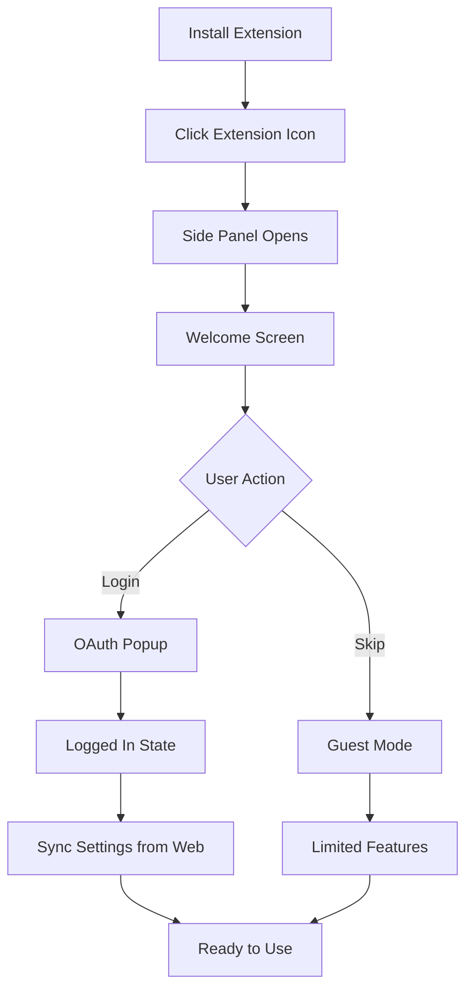
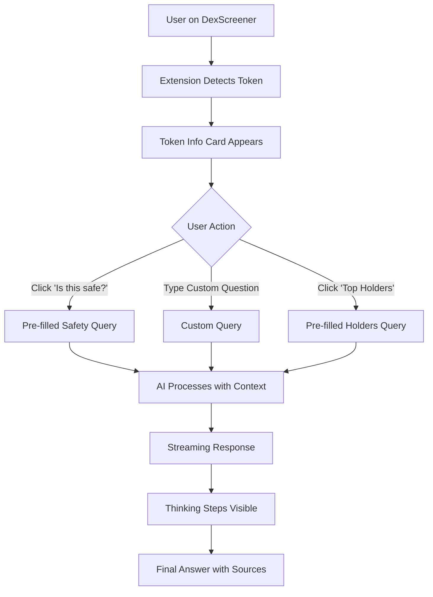
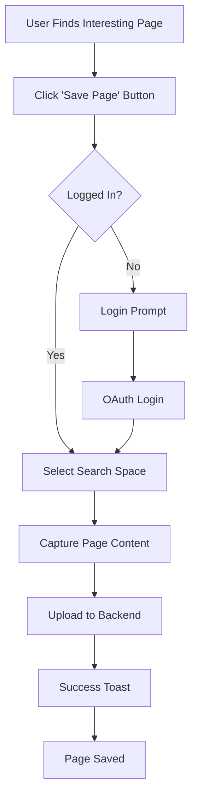

# SurfSense 2.0 Chrome Extension - UX Design Document

**Version:** 1.0  
**Date:** 2026-02-02  
**Status:** 🚧 DRAFT - Needs Wireframes & Design System  
**Owner:** UX Designer / PM

---

## Document Purpose

This UX Design Document provides comprehensive design guidance for the SurfSense 2.0 Chrome Extension. It covers:
- **Wireframes** for all key screens
- **User flows** for critical journeys
- **Design system** (colors, typography, spacing, components)
- **Interaction patterns** and micro-animations
- **Responsive behavior** and accessibility

**Target Audience:** Developers, Product Managers, QA Engineers

---

## Table of Contents

1. [Design Principles](#design-principles)
2. [User Flows](#user-flows)
3. [Wireframes](#wireframes)
4. [Design System](#design-system)
5. [Component Library](#component-library)
6. [Interaction Patterns](#interaction-patterns)
7. [Accessibility](#accessibility)
8. [Implementation Notes](#implementation-notes)

---

## Design Principles

### 1. **Context-Aware Intelligence**
- AI should understand what the user is viewing without explicit input
- Proactive suggestions based on page context (DexScreener, Twitter, etc.)
- Minimize cognitive load - users shouldn't need to explain context

### 2. **Seamless Integration**
- Extension feels like a natural part of the browsing experience
- Consistent with SurfSense web dashboard design language
- Non-intrusive - doesn't block content or disrupt workflow

### 3. **Speed & Efficiency**
- Quick access to AI insights (1-click actions)
- Keyboard shortcuts for power users
- Instant feedback for all interactions

### 4. **Trust & Transparency**
- Clear indication of AI reasoning (thinking steps)
- Explicit data sources and confidence levels
- Easy to verify AI suggestions

---

## User Flows

### Flow 1: First-Time User Onboarding



**Key Screens:**
1. Welcome Screen (first launch)
2. Login Screen (OAuth options)
3. Settings Sync Screen (loading state)
4. Main Chat Interface (ready state)

**Success Criteria:**
- User completes login in <30 seconds
- Settings sync automatically from web dashboard
- User understands core value proposition (AI co-pilot for crypto)

---

### Flow 2: Chat with AI about Token



**Key Screens:**
1. Token Info Card (context display)
2. Chat Input (with suggestions)
3. Streaming Response (thinking steps)
4. Final Answer (with tool UIs)

**Success Criteria:**
- Token detection happens in <1 second
- User can ask question in <5 seconds
- AI response starts streaming in <2 seconds

---

### Flow 3: Quick Capture Page



**Key Screens:**
1. Quick Capture Button (sticky footer)
2. Search Space Selector (modal)
3. Capturing State (loading)
4. Success Confirmation (toast)

**Success Criteria:**
- User can save page in <3 clicks
- Capture completes in <5 seconds
- Clear confirmation of success

---

## Wireframes

> **⚠️ TODO:** Add wireframes for all screens below. Use Figma, Excalidraw, or hand-drawn sketches.

### 1. Side Panel - Main Chat Interface

**Layout:**
```
┌─────────────────────────────────────┐
│ [Logo] SurfSense    [⚙️] [👤]      │ ← Header (60px)
├─────────────────────────────────────┤
│ 🪙 BULLA/SOL                        │ ← Token Info Card
│ $0.0001  📈 +15%                    │   (Conditional, 120px)
│ Vol: $10K | Liq: $5K                │
│ [Is this safe?] [Top Holders]       │
├─────────────────────────────────────┤
│                                     │
│ Chat Messages Area                  │ ← Scrollable Chat
│ (Scrollable)                        │   (Flex-grow)
│                                     │
│ [AI]: Analyzing token...            │
│ [Thinking steps visible]            │
│                                     │
│ [User]: Is this token safe?         │
│                                     │
├─────────────────────────────────────┤
│ [Type your message...]       [📎]  │ ← Chat Input (80px)
│                              [🎤]  │
├─────────────────────────────────────┤
│        📸 Save Current Page         │ ← Quick Capture
└─────────────────────────────────────┘   (Sticky, 50px)

Total Height: Viewport height
Width: 400px (default), resizable 300-600px
```

**Components:**
- Header: Logo, Settings dropdown, User profile
- Token Info Card: Conditional (only on DexScreener)
- Chat Messages: Scrollable, auto-scroll to bottom
- Chat Input: Text area with attachment button
- Quick Capture: Sticky footer button

**States:**
- Loading: Skeleton screens for chat messages
- Empty: Welcome message with suggestions
- Error: Inline error messages with retry button

---

### 2. Welcome Screen (First Launch)

```
┌─────────────────────────────────────┐
│                                     │
│         🌊 SurfSense                │
│    AI Co-Pilot for Crypto           │
│                                     │
│  Chat with AI about any token       │
│  Get instant safety checks          │
│  Save insights to your knowledge    │
│                                     │
│  ┌─────────────────────────────┐   │
│  │   🔐 Login with Google      │   │
│  └─────────────────────────────┘   │
│                                     │
│  ┌─────────────────────────────┐   │
│  │   📧 Login with Email       │   │
│  └─────────────────────────────┘   │
│                                     │
│       Skip for now (Guest)          │
│                                     │
└─────────────────────────────────────┘
```

**Copy:**
- Headline: "AI Co-Pilot for Crypto"
- Subheadline: "Chat with AI about any token, get instant safety checks, save insights"
- CTA: "Login with Google" (primary), "Login with Email" (secondary)
- Skip: "Skip for now (Guest)" (text link)

---

### 3. Token Info Card (DexScreener Context)

```
┌─────────────────────────────────────┐
│ 🪙 BULLA/SOL                        │
│ $0.0001234  📈 +15.3%               │
│ Vol: $10.2K | Liq: $5.1K            │
│                                     │
│ ┌──────────────┐ ┌────────────────┐│
│ │ Is this safe?│ │ Top Holders    ││
│ └──────────────┘ └────────────────┘│
│                                     │
│ ┌──────────────┐ ┌────────────────┐│
│ │ Price Predict│ │ Rug Pull Risk  ││
│ └──────────────┘ └────────────────┘│
└─────────────────────────────────────┘
```

**Data Displayed:**
- Token Symbol/Name (e.g., "BULLA/SOL")
- Current Price (e.g., "$0.0001234")
- 24h Change (e.g., "+15.3%" with color: green if positive, red if negative)
- 24h Volume (e.g., "$10.2K")
- Liquidity (e.g., "$5.1K")

**Quick Actions:**
- "Is this safe?" → Trigger safety check query
- "Top Holders" → Query blockchain for holder distribution
- "Price Predict" → AI price prediction
- "Rug Pull Risk" → Rug pull detection analysis

---

### 4. Settings Dropdown

```
┌─────────────────────────────────────┐
│ ⚙️ Settings                         │
├─────────────────────────────────────┤
│ Model: GPT-4 Turbo                  │ ← Read-only
│ Search Space: Crypto Research       │ ← Read-only
│                                     │
│ ─────────────────────────────────   │
│                                     │
│ 🔗 Manage Connectors                │ ← Link to web
│ 💬 View All Chats                   │ ← Link to web
│ ⚙️ Full Settings                    │ ← Link to web
│                                     │
│ ─────────────────────────────────   │
│                                     │
│ 🚪 Logout                           │
└─────────────────────────────────────┘
```

**Behavior:**
- Dropdown triggered by ⚙️ icon in header
- Model and Search Space are read-only (managed on web)
- Links open web dashboard in new tab
- Logout clears JWT and redirects to welcome screen

---

## Design System

> **⚠️ TODO:** Define complete design system with color palette, typography, spacing, and elevation.

### Colors

**Primary Palette:**
```css
--primary-50:  #E3F2FD;  /* Lightest blue */
--primary-100: #BBDEFB;
--primary-200: #90CAF9;
--primary-300: #64B5F6;
--primary-400: #42A5F5;
--primary-500: #2196F3;  /* Primary brand color */
--primary-600: #1E88E5;
--primary-700: #1976D2;
--primary-800: #1565C0;
--primary-900: #0D47A1;  /* Darkest blue */
```

**Semantic Colors:**
```css
--success: #4CAF50;   /* Green for positive changes */
--warning: #FF9800;   /* Orange for warnings */
--error: #F44336;     /* Red for errors/negative changes */
--info: #2196F3;      /* Blue for informational */
```

**Neutral Palette:**
```css
--gray-50:  #FAFAFA;
--gray-100: #F5F5F5;
--gray-200: #EEEEEE;
--gray-300: #E0E0E0;
--gray-400: #BDBDBD;
--gray-500: #9E9E9E;
--gray-600: #757575;
--gray-700: #616161;
--gray-800: #424242;
--gray-900: #212121;
```

**Dark Mode:**
```css
--bg-primary: #121212;
--bg-secondary: #1E1E1E;
--bg-tertiary: #2C2C2C;
--text-primary: #FFFFFF;
--text-secondary: #B0B0B0;
--text-tertiary: #808080;
```

---

### Typography

**Font Family:**
```css
--font-sans: 'Inter', -apple-system, BlinkMacSystemFont, 'Segoe UI', sans-serif;
--font-mono: 'JetBrains Mono', 'Fira Code', monospace;
```

**Font Sizes:**
```css
--text-xs:   12px;  /* Small labels */
--text-sm:   14px;  /* Body text, buttons */
--text-base: 16px;  /* Default body */
--text-lg:   18px;  /* Subheadings */
--text-xl:   20px;  /* Headings */
--text-2xl:  24px;  /* Large headings */
--text-3xl:  30px;  /* Hero text */
```

**Font Weights:**
```css
--font-normal: 400;
--font-medium: 500;
--font-semibold: 600;
--font-bold: 700;
```

**Line Heights:**
```css
--leading-tight: 1.25;
--leading-normal: 1.5;
--leading-relaxed: 1.75;
```

---

### Spacing

**Spacing Scale (8px base):**
```css
--space-1: 4px;
--space-2: 8px;
--space-3: 12px;
--space-4: 16px;
--space-5: 20px;
--space-6: 24px;
--space-8: 32px;
--space-10: 40px;
--space-12: 48px;
--space-16: 64px;
```

**Component Spacing:**
- Header padding: `--space-4` (16px)
- Card padding: `--space-4` (16px)
- Button padding: `--space-3` horizontal, `--space-2` vertical
- Input padding: `--space-3` (12px)
- Gap between elements: `--space-3` (12px)

---

### Border Radius

```css
--radius-sm: 4px;   /* Small elements (badges) */
--radius-md: 8px;   /* Buttons, inputs */
--radius-lg: 12px;  /* Cards */
--radius-xl: 16px;  /* Modals */
--radius-full: 9999px; /* Pills, avatars */
```

---

### Shadows

```css
--shadow-sm: 0 1px 2px 0 rgba(0, 0, 0, 0.05);
--shadow-md: 0 4px 6px -1px rgba(0, 0, 0, 0.1);
--shadow-lg: 0 10px 15px -3px rgba(0, 0, 0, 0.1);
--shadow-xl: 0 20px 25px -5px rgba(0, 0, 0, 0.1);
```

---

## Component Library

> **⚠️ TODO:** Create reusable component specs for all UI elements.

### Button

**Variants:**
- Primary: Filled with primary color
- Secondary: Outlined with primary color
- Ghost: Text-only, no background
- Danger: Filled with error color

**Sizes:**
- Small: 32px height, 12px padding
- Medium: 40px height, 16px padding
- Large: 48px height, 20px padding

**States:**
- Default: Normal state
- Hover: Darken background by 10%
- Active: Darken background by 20%
- Disabled: 50% opacity, no pointer events
- Loading: Show spinner, disable interaction

**Example:**
```tsx
<Button variant="primary" size="medium" loading={false}>
  Is this safe?
</Button>
```

---

### Input Field

**Variants:**
- Text: Single-line text input
- Textarea: Multi-line text input
- Search: Text input with search icon

**States:**
- Default: Border gray-300
- Focus: Border primary-500, shadow
- Error: Border error, show error message
- Disabled: Background gray-100, no interaction

**Example:**
```tsx
<Input
  placeholder="Type your message..."
  error="Please enter a message"
  disabled={false}
/>
```

---

### Card

**Variants:**
- Default: White background, shadow-md
- Outlined: Border gray-300, no shadow
- Elevated: shadow-lg

**Padding:**
- Default: 16px (--space-4)
- Compact: 12px (--space-3)
- Spacious: 24px (--space-6)

**Example:**
```tsx
<Card variant="elevated" padding="default">
  <CardHeader>Token Info</CardHeader>
  <CardBody>...</CardBody>
</Card>
```

---

### Toast Notification

**Variants:**
- Success: Green background, checkmark icon
- Error: Red background, error icon
- Info: Blue background, info icon
- Warning: Orange background, warning icon

**Position:**
- Top-right (default)
- Bottom-right
- Top-center

**Duration:**
- Default: 3 seconds
- Persistent: Manual dismiss

**Example:**
```tsx
<Toast variant="success" duration={3000}>
  Page saved successfully!
</Toast>
```

---

## Interaction Patterns

### Loading States

**Skeleton Screens:**
- Use for initial page load
- Animate shimmer effect (left to right)
- Match layout of actual content

**Spinners:**
- Use for button actions (e.g., "Saving...")
- Use for inline loading (e.g., "Loading chat history...")

**Progress Bars:**
- Use for file uploads
- Use for multi-step processes

---

### Micro-Animations

**Hover Effects:**
- Buttons: Scale 1.02, darken background
- Cards: Lift with shadow-lg
- Links: Underline on hover

**Click Effects:**
- Ripple effect on buttons
- Scale down to 0.98 on active

**Transitions:**
- Duration: 200ms (default)
- Easing: ease-in-out

---

### Keyboard Shortcuts

**Global:**
- `Cmd/Ctrl + K`: Focus chat input
- `Cmd/Ctrl + S`: Save current page
- `Esc`: Close modals, clear input

**Chat:**
- `Enter`: Send message
- `Shift + Enter`: New line
- `↑`: Edit last message
- `↓`: Navigate message history

---

## Accessibility

### WCAG 2.1 AA Compliance

**Color Contrast:**
- Text on background: Minimum 4.5:1 ratio
- Large text (18px+): Minimum 3:1 ratio
- Interactive elements: Minimum 3:1 ratio

**Keyboard Navigation:**
- All interactive elements focusable
- Visible focus indicators (2px outline)
- Logical tab order

**Screen Readers:**
- Semantic HTML (header, nav, main, footer)
- ARIA labels for icons and buttons
- ARIA live regions for dynamic content

**Motion:**
- Respect `prefers-reduced-motion`
- Disable animations if user prefers

---

## Implementation Notes

### Responsive Behavior

**Side Panel Width:**
- Default: 400px
- Minimum: 300px
- Maximum: 600px
- User can resize by dragging edge

**Breakpoints:**
- Small screens (<1280px): Default 300px width
- Medium screens (1280-1920px): Default 400px width
- Large screens (>1920px): Default 500px width

---

### Performance Considerations

**Loading States:**
- Show skeleton screens within 100ms
- Stream chat responses (don't wait for full response)
- Lazy load images in chat history

**Caching:**
- Cache token data for 5 minutes
- Cache chat history locally (Plasmo Storage)
- Prefetch user settings on login

**Debouncing:**
- Settings sync: Debounce 2 seconds after user action
- Search input: Debounce 300ms

---

### Error Handling

**Network Errors:**
- Show "Offline" indicator in header
- Queue actions for retry when online
- Clear error message with retry button

**API Errors:**
- Show inline error message
- Provide actionable guidance (e.g., "Try again" button)
- Log errors to backend for monitoring

**Validation Errors:**
- Show inline error message below input
- Highlight invalid fields with red border
- Prevent form submission until valid

---

## Next Steps

### Immediate Actions (Week 1)

1. **Create Wireframes** (3 days)
   - [ ] Main Chat Interface
   - [ ] Welcome Screen
   - [ ] Token Info Card
   - [ ] Settings Dropdown
   - [ ] Quick Capture Modal

2. **Define Design System** (2 days)
   - [ ] Finalize color palette
   - [ ] Choose typography (confirm Inter font)
   - [ ] Define spacing scale
   - [ ] Create shadow/elevation system

3. **Build Component Library** (2 days)
   - [ ] Button component
   - [ ] Input component
   - [ ] Card component
   - [ ] Toast component
   - [ ] Modal component

### Follow-up Actions (Week 2)

4. **Create User Flows** (2 days)
   - [ ] Onboarding flow (detailed)
   - [ ] Chat flow (detailed)
   - [ ] Quick Capture flow (detailed)

5. **Prototype in Figma** (3 days)
   - [ ] High-fidelity mockups
   - [ ] Interactive prototype
   - [ ] Handoff to developers

6. **Accessibility Audit** (1 day)
   - [ ] Color contrast check
   - [ ] Keyboard navigation test
   - [ ] Screen reader test

---

## Approval & Sign-off

**Stakeholders:**
- [ ] UX Designer: _______________ (Date: _______)
- [ ] Product Manager: _______________ (Date: _______)
- [ ] Tech Lead: _______________ (Date: _______)

**Status:** 🚧 DRAFT - Awaiting wireframes and design system completion

---

**Document Version History:**
- v1.0 (2026-02-02): Initial outline created
