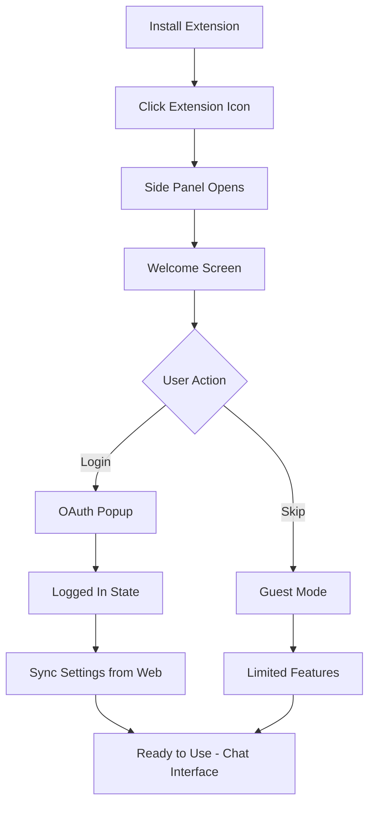
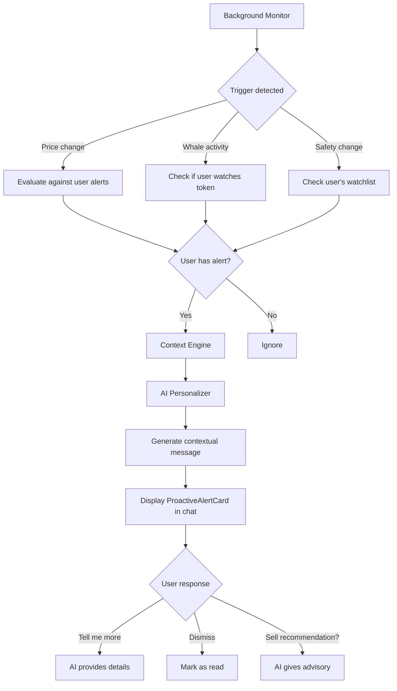
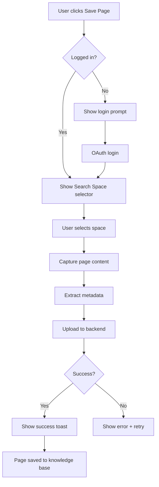

# SurfSense 2.0 Chrome Extension - UX Design Document

**Version:** 3.0 (Conversational UX Update)
**Date:** 2026-02-02
**Status:** ✅ COMPLETE
**Owner:** UX Designer (Sally)

---

## ⚠️ IMPORTANT: Conversational UX Paradigm Shift

> **This document has been updated to reflect the new Conversational AI approach.**
>
> **Key Change:** SurfSense is now a **conversational AI crypto advisor** where chat is the PRIMARY interface. All crypto features (watchlist, alerts, portfolio, analysis) are accessible through natural language commands and embedded as widgets within the chat experience.
>
> **See:** `_bmad-output/ux-design/conversational-ux-specification.md` for the complete Conversational UX Specification.

---

## Document Purpose

This UX Design Document provides comprehensive design guidance for the SurfSense 2.0 Chrome Extension - AI Co-Pilot for Crypto. It covers:
- **Conversational Interface** - Chat as the primary interaction method
- **Embedded Widgets** - Token analysis, watchlist, alerts displayed inline in chat
- **AI Tool Calling** - Natural language commands that trigger backend tools
- **Proactive Monitoring** - AI-initiated alerts and recommendations
- **Design system** (colors, typography, spacing, components)
- **Interaction patterns** and micro-animations

**Target Audience:** Developers, Product Managers, QA Engineers

> 📌 **Related Documents:**
> - `_bmad-output/ux-design/conversational-ux-specification.md` - Complete Conversational UX Spec
> - `_bmad-output/planning-artifacts/prd.md` - Product Requirements

---

## Table of Contents

1. [Design Principles](#design-principles)
2. [Conversational UX Architecture](#conversational-ux-architecture) ⭐ NEW
3. [Information Architecture](#information-architecture)
4. [User Flows](#user-flows)
5. [Wireframes](#wireframes)
6. [Embedded Widget Components](#embedded-widget-components) ⭐ NEW
7. [Design System](#design-system)
8. [Component Library](#component-library)
9. [Interaction Patterns](#interaction-patterns)
10. [Accessibility](#accessibility)
11. [Implementation Notes](#implementation-notes)

---

## Design Principles

### 1. **Conversation-First Interface** ⭐ UPDATED
- **Chat is the PRIMARY interface** - all features accessible via natural language
- AI understands context without explicit input (page detection, portfolio awareness)
- Users interact through conversation, not navigation between screens
- **Example:** "Add BULLA to watchlist" instead of clicking through menus

### 2. **AI as Proactive Advisor** ⭐ UPDATED
- AI doesn't just respond - it **anticipates user needs**
- Proactive alerts based on portfolio, watchlist, and market conditions
- Personalized recommendations based on user's risk profile
- **Example:** AI alerts user when a watched token shows unusual activity

### 3. **Embedded Widgets in Chat** ⭐ NEW
- Crypto data displayed as **interactive widgets within chat messages**
- Widgets have inline action buttons (Add to Watchlist, Set Alert)
- No separate screens for Watchlist, Alerts, Portfolio - all embedded in chat
- **Example:** Token analysis appears as a rich card with action buttons

### 4. **Context-Aware Intelligence**
- AI understands what the user is viewing without explicit input
- Proactive suggestions based on page context (DexScreener, Twitter, etc.)
- Minimize cognitive load - users shouldn't need to explain context
- **Auto-detect tokens** on supported sites and pre-populate context

### 5. **Speed & Efficiency**
- Quick access to AI insights (natural language commands)
- Keyboard shortcuts for power users
- Instant feedback for all interactions
- **Target: <1s token detection, <2s AI response start**

### 6. **Trust & Transparency**
- Clear indication of AI reasoning (thinking steps)
- Explicit data sources and confidence levels
- Easy to verify AI suggestions
- **Safety scores with detailed breakdown**

---

## Conversational UX Architecture ⭐ NEW

> **Core Principle:** Chat is the primary interface. All crypto features are accessible through natural language and displayed as embedded widgets within the conversation.

### Interaction Model

```
┌─────────────────────────────────────────────────────────────────┐
│                    CONVERSATIONAL INTERFACE                      │
├─────────────────────────────────────────────────────────────────┤
│                                                                  │
│  USER INPUT (Natural Language)                                   │
│  ├── "Research BULLA token"                                      │
│  ├── "Add to my watchlist"                                       │
│  ├── "Set alert if price drops 20%"                              │
│  └── "Show my portfolio"                                         │
│                                                                  │
│           ↓                                                      │
│                                                                  │
│  AI PROCESSING                                                   │
│  ├── Intent Recognition                                          │
│  ├── Context Injection (portfolio, watchlist, risk profile)      │
│  ├── Tool Calling (DexScreener, Safety Check, etc.)              │
│  └── Response Generation                                         │
│                                                                  │
│           ↓                                                      │
│                                                                  │
│  EMBEDDED WIDGET RESPONSE                                        │
│  ├── TokenAnalysisCard (price, safety, metrics)                  │
│  ├── WatchlistWidget (inline list with actions)                  │
│  ├── AlertWidget (confirmation with edit options)                │
│  └── ActionConfirmation (success/failure feedback)               │
│                                                                  │
└─────────────────────────────────────────────────────────────────┘
```

### Natural Language Commands

| User Says | AI Action | Widget Displayed |
|-----------|-----------|------------------|
| "Research BULLA" | Call DexScreener + Safety Check | TokenAnalysisCard |
| "Is this safe?" | Call Safety Analysis | SafetyScoreWidget |
| "Add to watchlist" | Execute add_to_watchlist tool | ActionConfirmation |
| "Set price alert at $0.001" | Execute set_alert tool | AlertWidget |
| "Show my watchlist" | Fetch user's watchlist | WatchlistWidget |
| "What's trending on Solana?" | Call trending tokens API | TrendingTokensWidget |
| "Analyze my portfolio" | Fetch portfolio + analysis | PortfolioWidget |

### Widget Types

1. **TokenAnalysisCard** - Full token analysis with price, safety, metrics
2. **SafetyScoreWidget** - Detailed safety breakdown with risk factors
3. **WatchlistWidget** - Inline watchlist with quick actions
4. **AlertWidget** - Alert configuration/confirmation
5. **ActionConfirmation** - Success/failure feedback for actions
6. **TrendingTokensWidget** - List of trending tokens
7. **PortfolioWidget** - Portfolio summary with P&L
8. **ProactiveAlertCard** - AI-initiated alerts (price changes, whale activity)

### Action Types

| Type | Description | Example | Requires Confirmation |
|------|-------------|---------|----------------------|
| **Immediate** | Safe actions, auto-execute | Add to watchlist | No |
| **Confirmation** | Potentially destructive | Clear all alerts | Yes |
| **Advisory** | AI suggests, never executes | "Consider selling" | N/A (info only) |

---

## Information Architecture ⭐ UPDATED

```
Side Panel (400px width) - CONVERSATIONAL INTERFACE
├── Header (56px)
│   ├── Logo + Brand
│   ├── Search Space Selector
│   └── Settings Menu
├── Page Context Bar (conditional, 48px) ⭐ SIMPLIFIED
│   ├── Detected Token: "BULLA/SOL on DexScreener"
│   └── Quick Actions: [Analyze] [Watchlist] [Alert]
├── Chat Area (flex-grow) ⭐ PRIMARY INTERFACE
│   ├── Welcome State (suggestions)
│   ├── Messages List
│   │   ├── User Messages
│   │   ├── AI Messages with Embedded Widgets
│   │   │   ├── TokenAnalysisCard
│   │   │   ├── SafetyScoreWidget
│   │   │   ├── WatchlistWidget
│   │   │   ├── AlertWidget
│   │   │   └── ActionConfirmation
│   │   └── Proactive Alert Cards
│   └── Thinking Steps (collapsible)
├── Suggestion Chips (40px)
│   └── Context-aware quick actions
├── Input Area (80px)
│   ├── Text Input
│   └── Send Button
└── Quick Capture (48px sticky)
```

**Key Changes from v2.0:**
- ❌ Removed: Separate Watchlist Panel, Alert Configuration Modal, Portfolio Page
- ✅ Added: Embedded widgets in chat, Proactive Alert Cards, Suggestion Chips
- ✅ Simplified: Page Context Bar (just shows detected token + quick actions)

---

## User Flows ⭐ UPDATED FOR CONVERSATIONAL UX

### Flow 1: First-Time User Onboarding



**Key Screens:**
1. Welcome Screen (first launch)
2. Login Screen (OAuth options)
3. Settings Sync Screen (loading state)
4. Main Chat Interface (ready state)

**Success Criteria:**
- User completes login in <30 seconds
- Settings sync automatically from web dashboard
- User understands core value proposition (AI co-pilot for crypto)

---

### Flow 2: Token Research via Conversation ⭐ UPDATED

```mermaid
flowchart TD
    A[User visits DexScreener] --> B{Extension detects token}
    B -->|Yes| C[Show Page Context Bar]
    B -->|No| D[Show default chat]
    C --> E{User interaction}
    E -->|Click 'Analyze'| F[AI: "Analyzing BULLA..."]
    E -->|Type "Is this safe?"| F
    E -->|Type "Research this token"| F
    F --> G[Show thinking steps in chat]
    G --> H[Display TokenAnalysisCard widget]
    H --> I{User says/clicks}
    I -->|"Add to watchlist"| J[AI executes action]
    I -->|"Set alert at +50%"| K[AI executes action]
    I -->|"Tell me more about holders"| L[AI continues analysis]
    J --> M[ActionConfirmation widget]
    K --> N[AlertWidget in chat]
    L --> O[HolderAnalysisWidget]
```

**Key Difference from v2.0:**
- ❌ Old: Click button → Open modal → Fill form → Save
- ✅ New: Say "add to watchlist" → AI executes → Confirmation in chat

**Success Criteria:**
- Token detection happens in <1 second
- User can complete any action via natural language
- All results displayed as embedded widgets in chat

---

### Flow 3: Proactive Alert Flow ⭐ NEW



**Example Proactive Alert:**
```
🔔 AI: "Heads up! BULLA just pumped +45% in the last hour.
       You have 500K tokens worth ~$6,200 now.

       Based on your moderate risk profile, you might want to
       consider taking some profits.

       [View Details] [Set New Alert] [Dismiss]"
```

---

### Flow 4: Quick Capture Page



**Key Screens:**
1. Quick Capture Button (sticky footer)
2. Search Space Selector (modal)
3. Capturing State (loading)
4. Success Confirmation (toast)

**Success Criteria:**
- User can save page in <3 clicks
- Capture completes in <5 seconds
- Clear confirmation of success

---

## Wireframes ⭐ UPDATED FOR CONVERSATIONAL UX

> **Key Change:** All wireframes now show embedded widgets within the chat interface, not separate screens.

### 1. Main Chat Interface with Page Context Bar

```
┌─────────────────────────────────────────┐
│ 🌊 SurfSense        [Crypto ▼] [⚙️] [👤]│
├─────────────────────────────────────────┤
│ 📍 BULLA/SOL on DexScreener             │
│    $0.00001234 (+156%)  [Analyze][Watch]│
├─────────────────────────────────────────┤
│                                         │
│     Good morning, Alex! 🌊              │
│                                         │
│   I see you're looking at BULLA.        │
│   Want me to analyze it for you?        │
│                                         │
│   💡 Quick actions:                     │
│   ┌─────────────────────────────────┐   │
│   │ "Is this token safe?"           │   │
│   └─────────────────────────────────┘   │
│   ┌─────────────────────────────────┐   │
│   │ "Add to my watchlist"           │   │
│   └─────────────────────────────────┘   │
│   ┌─────────────────────────────────┐   │
│   │ "Show trending on Solana"       │   │
│   └─────────────────────────────────┘   │
│                                         │
├─────────────────────────────────────────┤
│ [What's trending?][My watchlist][Alerts]│
├─────────────────────────────────────────┤
│ ┌─────────────────────────────────────┐ │
│ │ Ask anything about crypto...   [→] │ │
│ └─────────────────────────────────────┘ │
├─────────────────────────────────────────┤
│  📸 Save this page to knowledge base    │
└─────────────────────────────────────────┘
```

**Components:**
- **Page Context Bar**: Shows detected token with quick actions
- **AI Greeting**: Context-aware welcome message
- **Suggestion Chips**: Clickable quick actions
- **Chat Input**: Natural language input

---

### 2. Token Analysis as Embedded Widget

```
┌─────────────────────────────────────────┐
│ 🌊 SurfSense        [Crypto ▼] [⚙️] [👤]│
├─────────────────────────────────────────┤
│ 📍 BULLA/SOL on DexScreener             │
├─────────────────────────────────────────┤
│                                         │
│  👤 You: Is this token safe?            │
│                                         │
│  🧠 AI: Analyzing BULLA on Solana...    │
│  ┌─────────────────────────────────┐    │
│  │ 🔍 Fetching price data...       │    │
│  │ 🛡️ Running safety analysis...   │    │
│  │ 👥 Checking holder distribution │    │
│  └─────────────────────────────────┘    │
│                                         │
│  🧠 AI: Here's my analysis of BULLA:    │
│  ┌─────────────────────────────────────┐│
│  │ 📊 TokenAnalysisCard               ││
│  │ ─────────────────────────────────  ││
│  │ 🪙 BULLA/SOL                       ││
│  │ $0.00001234      ▲ +156.7% (24h)   ││
│  │                                    ││
│  │ Vol: $1.2M | Liq: $450K | MC: $2.1M││
│  │                                    ││
│  │ 🛡️ Safety: 🟡 65/100 (Medium Risk) ││
│  │ ████████░░                         ││
│  │                                    ││
│  │ ✅ LP locked 6 months              ││
│  │ ✅ No mint authority               ││
│  │ ⚠️ Top 10 hold 45%                 ││
│  │ 🔴 Similar to known rugs           ││
│  │                                    ││
│  │ [➕ Watchlist] [🔔 Alert] [📊 More]││
│  └─────────────────────────────────────┘│
│                                         │
│  Based on your moderate risk profile,   │
│  I'd suggest a small position (2-5%).   │
│  Want me to add it to your watchlist?   │
│                                         │
├─────────────────────────────────────────┤
│ [Add to watchlist][Set alert][More info]│
├─────────────────────────────────────────┤
│ ┌─────────────────────────────────────┐ │
│ │ Ask follow-up question...      [→] │ │
│ └─────────────────────────────────────┘ │
└─────────────────────────────────────────┘
```

**Key Features:**
- **Thinking Steps**: Collapsible, shows AI's process
- **TokenAnalysisCard Widget**: Embedded in chat message
- **Inline Action Buttons**: Add to watchlist, Set alert directly from widget
- **Personalized Recommendation**: Based on user's risk profile
- **Suggestion Chips**: Context-aware follow-up actions

---

### 3. Safety Analysis Response

```
┌─────────────────────────────────────────┐
│  [AI] 🛡️ Safety Analysis: BULLA/SOL    │
│                                         │
│  ┌─────────────────────────────────────┐│
│  │ Overall Risk Score: 🟡 MEDIUM       ││
│  │ ████████░░ 65/100                   ││
│  └─────────────────────────────────────┘│
│                                         │
│  ✅ Positive Signals:                   │
│  • Contract verified on Solscan         │
│  • No mint authority (can't create more)│
│  • LP locked for 6 months               │
│                                         │
│  ⚠️ Warning Signs:                      │
│  • Top 10 holders own 45% of supply     │
│  • Token is only 3 days old             │
│  • Low social media presence            │
│                                         │
│  🔴 Red Flags:                          │
│  • Similar contract to known rug pulls  │
│                                         │
│  📊 Holder Distribution:                │
│  ┌─────────────────────────────────────┐│
│  │ Top 10: ████████░░ 45%              ││
│  │ Top 50: ██████████████░░ 72%        ││
│  │ Others: ██████░░░░░░░░░░ 28%        ││
│  └─────────────────────────────────────┘│
│                                         │
│  💡 Recommendation:                     │
│  Proceed with caution. Consider small   │
│  position size due to concentration     │
│  risk and young token age.              │
│                                         │
│  Sources: Solscan, DexScreener, RugCheck│
│                                         │
│  [📋 Add to Watchlist] [🔔 Set Alert]   │
└─────────────────────────────────────────┘
```

**Risk Score Colors:**
- 0-30: 🔴 High Risk (red)
- 31-60: � Medium Risk (yellow)
- 61-80: 🟢 Low Risk (green)
- 81-100: ✅ Very Safe (bright green)

---

### 4. Watchlist Panel

```
┌─────────────────────────────────────────┐
│ 🌊 SurfSense   [📋 Watchlist] [⚙️] [👤] │
├─────────────────────────────────────────┤
│ My Watchlist                    [+ Add] │
├─────────────────────────────────────────┤
│ ┌─────────────────────────────────────┐ │
│ │ 🪙 BULLA/SOL          ▲ +156.7%    │ │
│ │ $0.00001234           Vol: $1.2M   │ │
│ │ 🔔 Alert: Price > $0.00002         │ │
│ └─────────────────────────────────────┘ │
│ ┌─────────────────────────────────────┐ │
│ │ 🪙 PEPE/ETH           ▼ -12.3%     │ │
│ │ $0.00000891           Vol: $45M    │ │
│ │ 🔔 Alert: Volume spike detected    │ │
│ └─────────────────────────────────────┘ │
│ ┌─────────────────────────────────────┐ │
│ │ 🪙 WIF/SOL            ▲ +8.2%      │ │
│ │ $2.34                 Vol: $89M    │ │
│ │ ✓ No active alerts                 │ │
│ └─────────────────────────────────────┘ │
├─────────────────────────────────────────┤
│ Recent Alerts                           │
├─────────────────────────────────────────┤
│ 🔴 2m ago: BULLA whale sold 5% supply   │
│ 🟡 15m ago: PEPE unusual volume spike   │
│ 🟢 1h ago: WIF hit price target $2.30   │
├─────────────────────────────────────────┤
│ ┌─────────────────────────────────────┐ │
│ │ Ask about your watchlist...  [📎][→]│ │
│ └─────────────────────────────────────┘ │
└─────────────────────────────────────────┘
```

---

### 5. Alert Configuration Modal

```
┌─────────────────────────────────────────┐
│ 🔔 Configure Alert for BULLA/SOL    [×]│
├─────────────────────────────────────────┤
│                                         │
│ Alert Type:                             │
│ ┌─────────────────────────────────────┐ │
│ │ ○ Price reaches                     │ │
│ │ ○ Price change % (24h)              │ │
│ │ ● Volume spike                      │ │
│ │ ○ Whale movement                    │ │
│ │ ○ Liquidity change                  │ │
│ │ ○ New holder concentration          │ │
│ └─────────────────────────────────────┘ │
│                                         │
│ Condition:                              │
│ ┌─────────────────────────────────────┐ │
│ │ Volume increases by [  200  ] %     │ │
│ │ within [ 1 hour ▼ ]                 │ │
│ └─────────────────────────────────────┘ │
│                                         │
│ Notification:                           │
│ ☑ Browser notification                  │
│ ☑ Email alert                           │
│ ☐ Telegram (connect in settings)        │
│                                         │
│ ┌─────────────────────────────────────┐ │
│ │         💾 Save Alert               │ │
│ └─────────────────────────────────────┘ │
│                                         │
└─────────────────────────────────────────┘
```

**Alert Types:**
- Price reaches target
- Price change % (24h)
- Volume spike
- Whale movement (large transactions)
- Liquidity change
- Holder concentration change

---

### 6. Welcome Screen (First Launch)

```
┌─────────────────────────────────────────┐
│                                         │
│         🌊 SurfSense                    │
│    AI Co-Pilot for Crypto               │
│                                         │
│  Chat with AI about any token           │
│  Get instant safety checks              │
│  Save insights to your knowledge        │
│                                         │
│  ┌─────────────────────────────────┐    │
│  │   🔐 Login with Google          │    │
│  └─────────────────────────────────┘    │
│                                         │
│  ┌─────────────────────────────────┐    │
│  │   📧 Login with Email           │    │
│  └─────────────────────────────────┘    │
│                                         │
│       Skip for now (Guest)              │
│                                         │
└─────────────────────────────────────────┘
```

**Copy:**
- Headline: "AI Co-Pilot for Crypto"
- Subheadline: "Chat with AI about any token, get instant safety checks, save insights"
- CTA: "Login with Google" (primary), "Login with Email" (secondary)
- Skip: "Skip for now (Guest)" (text link)

---

### 7. Settings Dropdown

```
┌─────────────────────────────────────┐
│ ⚙️ Settings                         │
├─────────────────────────────────────┤
│ Model: GPT-4 Turbo                  │ ← Read-only
│ Search Space: Crypto Research       │ ← Read-only
│                                     │
│ ─────────────────────────────────   │
│                                     │
│ 🔗 Manage Connectors                │ ← Link to web
│ 💬 View All Chats                   │ ← Link to web
│ ⚙️ Full Settings                    │ ← Link to web
│ 📋 Manage Watchlist                 │ ← Link to web
│ 🔔 Alert History                    │ ← Link to web
│                                     │
│ ─────────────────────────────────   │
│                                     │
│ 🚪 Logout                           │
└─────────────────────────────────────┘
```

**Behavior:**
- Dropdown triggered by ⚙️ icon in header
- Model and Search Space are read-only (managed on web)
- Links open web dashboard in new tab
- Logout clears JWT and redirects to welcome screen

---

## Design System

> **⚠️ TODO:** Define complete design system with color palette, typography, spacing, and elevation.

### Colors

**Primary Palette:**
```css
--primary-50:  #E3F2FD;  /* Lightest blue */
--primary-100: #BBDEFB;
--primary-200: #90CAF9;
--primary-300: #64B5F6;
--primary-400: #42A5F5;
--primary-500: #2196F3;  /* Primary brand color */
--primary-600: #1E88E5;
--primary-700: #1976D2;
--primary-800: #1565C0;
--primary-900: #0D47A1;  /* Darkest blue */
```

**Semantic Colors:**
```css
--success: #4CAF50;   /* Green for positive changes */
--warning: #FF9800;   /* Orange for warnings */
--error: #F44336;     /* Red for errors/negative changes */
--info: #2196F3;      /* Blue for informational */
```

**Neutral Palette:**
```css
--gray-50:  #FAFAFA;
--gray-100: #F5F5F5;
--gray-200: #EEEEEE;
--gray-300: #E0E0E0;
--gray-400: #BDBDBD;
--gray-500: #9E9E9E;
--gray-600: #757575;
--gray-700: #616161;
--gray-800: #424242;
--gray-900: #212121;
```

**Dark Mode:**
```css
--bg-primary: #121212;
--bg-secondary: #1E1E1E;
--bg-tertiary: #2C2C2C;
--text-primary: #FFFFFF;
--text-secondary: #B0B0B0;
--text-tertiary: #808080;
```

---

### Typography

**Font Family:**
```css
--font-sans: 'Inter', -apple-system, BlinkMacSystemFont, 'Segoe UI', sans-serif;
--font-mono: 'JetBrains Mono', 'Fira Code', monospace;
```

**Font Sizes:**
```css
--text-xs:   12px;  /* Small labels */
--text-sm:   14px;  /* Body text, buttons */
--text-base: 16px;  /* Default body */
--text-lg:   18px;  /* Subheadings */
--text-xl:   20px;  /* Headings */
--text-2xl:  24px;  /* Large headings */
--text-3xl:  30px;  /* Hero text */
```

**Font Weights:**
```css
--font-normal: 400;
--font-medium: 500;
--font-semibold: 600;
--font-bold: 700;
```

**Line Heights:**
```css
--leading-tight: 1.25;
--leading-normal: 1.5;
--leading-relaxed: 1.75;
```

---

### Spacing

**Spacing Scale (8px base):**
```css
--space-1: 4px;
--space-2: 8px;
--space-3: 12px;
--space-4: 16px;
--space-5: 20px;
--space-6: 24px;
--space-8: 32px;
--space-10: 40px;
--space-12: 48px;
--space-16: 64px;
```

**Component Spacing:**
- Header padding: `--space-4` (16px)
- Card padding: `--space-4` (16px)
- Button padding: `--space-3` horizontal, `--space-2` vertical
- Input padding: `--space-3` (12px)
- Gap between elements: `--space-3` (12px)

---

### Border Radius

```css
--radius-sm: 4px;   /* Small elements (badges) */
--radius-md: 8px;   /* Buttons, inputs */
--radius-lg: 12px;  /* Cards */
--radius-xl: 16px;  /* Modals */
--radius-full: 9999px; /* Pills, avatars */
```

---

### Shadows

```css
--shadow-sm: 0 1px 2px 0 rgba(0, 0, 0, 0.05);
--shadow-md: 0 4px 6px -1px rgba(0, 0, 0, 0.1);
--shadow-lg: 0 10px 15px -3px rgba(0, 0, 0, 0.1);
--shadow-xl: 0 20px 25px -5px rgba(0, 0, 0, 0.1);
```

---

## Component Library

> **⚠️ TODO:** Create reusable component specs for all UI elements.

### Button

**Variants:**
- Primary: Filled with primary color
- Secondary: Outlined with primary color
- Ghost: Text-only, no background
- Danger: Filled with error color

**Sizes:**
- Small: 32px height, 12px padding
- Medium: 40px height, 16px padding
- Large: 48px height, 20px padding

**States:**
- Default: Normal state
- Hover: Darken background by 10%
- Active: Darken background by 20%
- Disabled: 50% opacity, no pointer events
- Loading: Show spinner, disable interaction

**Example:**
```tsx
<Button variant="primary" size="medium" loading={false}>
  Is this safe?
</Button>
```

---

### Input Field

**Variants:**
- Text: Single-line text input
- Textarea: Multi-line text input
- Search: Text input with search icon

**States:**
- Default: Border gray-300
- Focus: Border primary-500, shadow
- Error: Border error, show error message
- Disabled: Background gray-100, no interaction

**Example:**
```tsx
<Input
  placeholder="Type your message..."
  error="Please enter a message"
  disabled={false}
/>
```

---

### Card

**Variants:**
- Default: White background, shadow-md
- Outlined: Border gray-300, no shadow
- Elevated: shadow-lg

**Padding:**
- Default: 16px (--space-4)
- Compact: 12px (--space-3)
- Spacious: 24px (--space-6)

**Example:**
```tsx
<Card variant="elevated" padding="default">
  <CardHeader>Token Info</CardHeader>
  <CardBody>...</CardBody>
</Card>
```

---

### Toast Notification

**Variants:**
- Success: Green background, checkmark icon
- Error: Red background, error icon
- Info: Blue background, info icon
- Warning: Orange background, warning icon

**Position:**
- Top-right (default)
- Bottom-right
- Top-center

**Duration:**
- Default: 3 seconds
- Persistent: Manual dismiss

**Example:**
```tsx
<Toast variant="success" duration={3000}>
  Page saved successfully!
</Toast>
```

---

## Interaction Patterns

### Loading States

**Skeleton Screens:**
- Use for initial page load
- Animate shimmer effect (left to right)
- Match layout of actual content

**Spinners:**
- Use for button actions (e.g., "Saving...")
- Use for inline loading (e.g., "Loading chat history...")

**Progress Bars:**
- Use for file uploads
- Use for multi-step processes

---

### Micro-Animations

**Hover Effects:**
- Buttons: Scale 1.02, darken background
- Cards: Lift with shadow-lg
- Links: Underline on hover

**Click Effects:**
- Ripple effect on buttons
- Scale down to 0.98 on active

**Transitions:**
- Duration: 200ms (default)
- Easing: ease-in-out

---

### Keyboard Shortcuts

**Global:**
- `Cmd/Ctrl + K`: Focus chat input
- `Cmd/Ctrl + S`: Save current page
- `Esc`: Close modals, clear input

**Chat:**
- `Enter`: Send message
- `Shift + Enter`: New line
- `↑`: Edit last message
- `↓`: Navigate message history

---

## Accessibility

### WCAG 2.1 AA Compliance

**Color Contrast:**
- Text on background: Minimum 4.5:1 ratio
- Large text (18px+): Minimum 3:1 ratio
- Interactive elements: Minimum 3:1 ratio

**Keyboard Navigation:**
- All interactive elements focusable
- Visible focus indicators (2px outline)
- Logical tab order

**Screen Readers:**
- Semantic HTML (header, nav, main, footer)
- ARIA labels for icons and buttons
- ARIA live regions for dynamic content

**Motion:**
- Respect `prefers-reduced-motion`
- Disable animations if user prefers

---

## Implementation Notes

### Responsive Behavior

**Side Panel Width:**
- Default: 400px
- Minimum: 300px
- Maximum: 600px
- User can resize by dragging edge

**Breakpoints:**
- Small screens (<1280px): Default 300px width
- Medium screens (1280-1920px): Default 400px width
- Large screens (>1920px): Default 500px width

---

### Performance Considerations

**Loading States:**
- Show skeleton screens within 100ms
- Stream chat responses (don't wait for full response)
- Lazy load images in chat history

**Caching:**
- Cache token data for 5 minutes
- Cache chat history locally (Plasmo Storage)
- Prefetch user settings on login

**Debouncing:**
- Settings sync: Debounce 2 seconds after user action
- Search input: Debounce 300ms

---

### Error Handling

**Network Errors:**
- Show "Offline" indicator in header
- Queue actions for retry when online
- Clear error message with retry button

**API Errors:**
- Show inline error message
- Provide actionable guidance (e.g., "Try again" button)
- Log errors to backend for monitoring

**Validation Errors:**
- Show inline error message below input
- Highlight invalid fields with red border
- Prevent form submission until valid

---

## Next Steps

### Immediate Actions (Week 1)

1. **Create Wireframes** (3 days)
   - [ ] Main Chat Interface
   - [ ] Welcome Screen
   - [ ] Token Info Card
   - [ ] Settings Dropdown
   - [ ] Quick Capture Modal

2. **Define Design System** (2 days)
   - [ ] Finalize color palette
   - [ ] Choose typography (confirm Inter font)
   - [ ] Define spacing scale
   - [ ] Create shadow/elevation system

3. **Build Component Library** (2 days)
   - [ ] Button component
   - [ ] Input component
   - [ ] Card component
   - [ ] Toast component
   - [ ] Modal component

### Follow-up Actions (Week 2)

4. **Create User Flows** (2 days)
   - [ ] Onboarding flow (detailed)
   - [ ] Chat flow (detailed)
   - [ ] Quick Capture flow (detailed)

5. **Prototype in Figma** (3 days)
   - [ ] High-fidelity mockups
   - [ ] Interactive prototype
   - [ ] Handoff to developers

6. **Accessibility Audit** (1 day)
   - [ ] Color contrast check
   - [ ] Keyboard navigation test
   - [ ] Screen reader test

---

## Approval & Sign-off

**Stakeholders:**
- [x] UX Designer: Augment Agent (Date: 2026-02-02)
- [ ] Product Manager: _______________ (Date: _______)
- [ ] Tech Lead: _______________ (Date: _______)

**Status:** ✅ COMPLETE - Ready for developer handoff

---

**Document Version History:**
- v3.0 (2026-02-02): **Conversational UX Update** - Major paradigm shift to chat-first interface with embedded widgets
- v2.0 (2026-02-02): Complete UX design with wireframes, user flows, and crypto features
- v1.0 (2026-02-02): Initial outline created

---

## Appendix: Conversational UX Wireframes (v3.0)

> **Note:** These wireframes replace the isolated component designs in sections 3-5 above. The new approach embeds all crypto features as widgets within the chat interface.

### A1. Action Confirmation Widget

```
┌─────────────────────────────────────────┐
│                                         │
│  👤 You: Add it to my watchlist         │
│                                         │
│  🧠 AI: Done!                           │
│  ┌─────────────────────────────────────┐│
│  │ ActionConfirmation                 ││
│  │ ─────────────────────────────────  ││
│  │ BULLA added to your watchlist      ││
│  │                                    ││
│  │ I've also set up default alerts:   ││
│  │ - Price change +/-20%              ││
│  │ - Liquidity drop >10%              ││
│  │ - Whale movement >$50K             ││
│  │                                    ││
│  │ [View Watchlist] [Edit Alerts]     ││
│  └─────────────────────────────────────┘│
│                                         │
│  Anything else you'd like to know       │
│  about BULLA or other tokens?           │
│                                         │
├─────────────────────────────────────────┤
│ [Show watchlist][Research another token]│
└─────────────────────────────────────────┘
```

---

### A2. Watchlist Widget (Embedded in Chat)

```
┌─────────────────────────────────────────┐
│                                         │
│  👤 You: Show my watchlist              │
│                                         │
│  🧠 AI: Here's your watchlist:          │
│  ┌─────────────────────────────────────┐│
│  │ WatchlistWidget                    ││
│  │ ─────────────────────────────────  ││
│  │ BULLA/SOL         +156.7%          ││
│  │    $0.00001234    3 alerts         ││
│  │    [Analyze] [Remove]              ││
│  │ ─────────────────────────────────  ││
│  │ PEPE/ETH          -12.3%           ││
│  │    $0.00000891    1 alert          ││
│  │    [Analyze] [Remove]              ││
│  │ ─────────────────────────────────  ││
│  │ WIF/SOL           +8.2%            ││
│  │    $2.34          No alerts        ││
│  │    [Analyze] [Remove]              ││
│  │ ─────────────────────────────────  ││
│  │ Total: 3 tokens | [+ Add Token]    ││
│  └─────────────────────────────────────┘│
│                                         │
│  BULLA is up 156% - your best performer!│
│  Want me to analyze if it's time to     │
│  take profits?                          │
│                                         │
├─────────────────────────────────────────┤
│ [Analyze BULLA][Add token][Clear all]   │
└─────────────────────────────────────────┘
```

**Key Difference from v2.0:**
- Old: Separate Watchlist Panel (navigation required)
- New: Watchlist displayed inline in chat when requested

---

### A3. Proactive Alert Card

```
┌─────────────────────────────────────────┐
│                                         │
│  AI Alert (just now)                    │
│  ┌─────────────────────────────────────┐│
│  │ ProactiveAlertCard                 ││
│  │ ─────────────────────────────────  ││
│  │ BULLA just pumped +45% in 1 hour!  ││
│  │                                    ││
│  │ Current: $0.00001789               ││
│  │ Your entry: $0.00000500            ││
│  │ Your P&L: +257% (~$3,200)          ││
│  │                                    ││
│  │ Warning: Volume spike (5x avg)     ││
│  │ Warning: Whale sold 2% of supply   ││
│  │                                    ││
│  │ [View Details] [Set New Alert]     ││
│  └─────────────────────────────────────┘│
│                                         │
│  Based on your moderate risk profile,   │
│  you might want to consider taking      │
│  some profits. This is just a           │
│  suggestion - I won't execute trades.   │
│                                         │
├─────────────────────────────────────────┤
│ [Tell me more][Dismiss][Set sell alert] │
└─────────────────────────────────────────┘
```

**Key Features:**
- **Proactive**: AI initiates the alert, not user
- **Contextual**: Shows user's position and P&L
- **Advisory**: Suggests action but doesn't execute
- **Actionable**: Quick follow-up options

---

### A4. Alert Configuration via Conversation

```
┌─────────────────────────────────────────┐
│                                         │
│  👤 You: Set alert if BULLA drops 20%   │
│                                         │
│  🧠 AI: I'll set that up for you:       │
│  ┌─────────────────────────────────────┐│
│  │ AlertWidget                        ││
│  │ ─────────────────────────────────  ││
│  │ Alert Created                      ││
│  │                                    ││
│  │ Token: BULLA/SOL                   ││
│  │ Condition: Price drops 20%         ││
│  │ Current: $0.00001234               ││
│  │ Trigger at: $0.00000987            ││
│  │                                    ││
│  │ Notify via:                        ││
│  │ [x] Browser notification           ││
│  │ [x] In-app alert                   ││
│  │ [ ] Email (not configured)         ││
│  │                                    ││
│  │ [Edit] [Delete] [Add Another]      ││
│  └─────────────────────────────────────┘│
│                                         │
│  Done! I'll notify you if BULLA drops   │
│  20% from current price. Want to set    │
│  any other alerts?                      │
│                                         │
├─────────────────────────────────────────┤
│ [View all alerts][Set another][Done]    │
└─────────────────────────────────────────┘
```

**Key Difference from v2.0:**
- Old: Open modal -> Select type -> Fill form -> Save
- New: Say "set alert if drops 20%" -> AI creates -> Confirm in chat

---

### A5. Summary: v2.0 vs v3.0 Comparison

| Feature | v2.0 (Isolated Components) | v3.0 (Conversational) |
|---------|---------------------------|----------------------|
| **Watchlist** | Separate panel with navigation | Embedded widget in chat |
| **Alerts** | Modal form with dropdowns | Natural language command |
| **Token Analysis** | Context card + separate response | Embedded TokenAnalysisCard |
| **Portfolio** | Separate page | Inline PortfolioWidget |
| **User Interaction** | Click through menus | Type natural language |
| **AI Role** | Responds to queries | Proactively advises |
| **Actions** | Manual form submission | AI executes on command |
